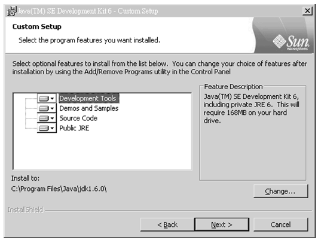
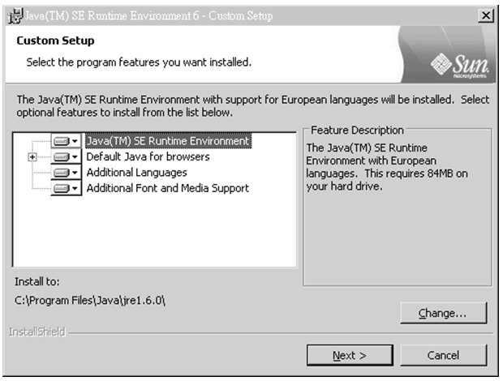

第 2 章 入門準備
================

Java 初學者最常遇到的狀況是 … 在高高興興的下載了所謂的「Java 程式」安裝之後，就開始遇到一大堆的問題與挫折。下載、安裝程式從操作上看確實是很簡單，但是您真的知道下載了什麼東西嗎？您安裝了什麼程式？程式安裝到哪裡去？安裝完畢後該進行的相關設定又有哪些？為什麼要作這些設定？

如果您曾經因為安裝所謂的「Java 程式」而遇到一大堆的問題與挫折，您可以看看這個章節，重新瞭解您所要安裝的東西是什麼？瞭解什麼是 JDK、JRE？如何設定 Path 與 Classpath？如何成功撰寫第一個 Java 程式？

使用純文字檔案撰寫 Java 程式是第一步，建議每個Java的初學者從使用純文字檔案開始，然而所謂「工欲善其事、必先利其器」，選擇一個好的開發工具也是必要的，在這個章節的最後談到了一些開發工具，作為您選擇開發工具的參考。

----------

2.1 下載、安裝、瞭解 JDK
-------------------------

要使用 Java 開發程式的第一步，就是安裝 JDK（Java SE Development Kit），這邊以 Java SE 6 Development Kit 安裝作為範例，以實作的方式一步步帶您瞭解 JDK。

## 2.1.1 下載 JDK ##

安裝 JDK 的第一步是先下載安裝檔案，這邊要下載的是 Sun 公司的 Java SE 6 Development Kit，下載的網址是：

- http://java.sun.com/javase/downloads/index.jsp

圖 2.1 Java SE 6 下載頁面

圖 2.1 是撰寫此書時 Java SE 6 下載網頁的擷取畫面，JDK 6 發表日期為 **2006 年 12 月 11 日**，Sun 公司會在必要的時候公佈修正版本以修正一些臭蟲（bug），您在看此書時可能已經有較新的版本，較新的修正版本將以 Update 名稱，加上號碼來表示修正的版本號。以下簡介頁面中的幾個可下載檔案之作用：

- JDK 6
    
    JDK 6 是建議您要下載的安裝程式，這個下載檔案中包括了公用（Public）JRE 安裝選擇，所以您不必額外下載 JRE 6。

- JDK 6 with NetBeans 5.5

    包括了 JDK 6 與 NetBeans 整合開發環境（Integrated Development Environment, IDE），有相當多的開發人員使用 NetBeans 來開發 Java 程式，這邊假設您沒有使用過任何的 IDE，所以不下載 JDK 6 with NetBeans 5.5 來安裝。
    
- Java Runtime Environment (JRE) 6

    如果想要執行 Java 所開發的程式，電腦上必須安裝有 JRE，如果您打算讓其他人可以執行您所撰寫 Java 程式，則可以建議他下載 JRE 進行安裝。
    
- Java SE 6 Documentation

    這份文件提供 Java SE 6 所有 API（Application Programming Interface）的用途與使用方式介紹，在往後開發 Java 程式的過程中，會很頻繁的使用這份文件，您可以下載這份文件，往後就不必連上網路來查詢文件。
除了以上幾個下載檔案的介紹之外，下載頁面上還有 JDK 6 的原始碼下載，以及一些進階開發人員才會用的到的下載檔案，目前您無需理會它們，您只要下載 JDK 6 就可以了。

    以圖 2.1 為例，按下「JDK 6」的「Download」鏈結文字後，會連到「Download Center - Download」網頁，由於這邊的 JDK 6 是 Sun 公司的產品，所以您必須同意它的使用條款才可以下載，選擇「Accept」後，就可以進行 JDK 6 安裝檔案的下載。

    

    圖 2.2 Download Center – Download 網頁

    在圖 2.2 中，您可以看到數個不同平台下的 JDK 安裝檔案，這邊假設您的作業系統是 Windows 2000/XP，所以請下載 Windows 平台的安裝檔案。檔案有 Windows Offline Installation, Multi-language，這個檔案是離線安裝檔案，所有安裝過程中必要的內容都在檔案中，所以檔案容量有53 MB 之多，另外還有 Windows Online Installation, Multi-language，可以讓您根據實際選擇的項目透過網路進行安裝，如果您的網路速度夠快，可以下載這個檔案。
    
    建議選擇下載離線安裝檔案，在安裝完畢後可以備份在電腦中，日後如果需要重新安裝的話就很方便。

## 2.1.2 安裝JDK ##

這邊假設您下載後的 JDK 安裝檔案名稱是 jdk-6-windows-i586.exe，按兩下這個檔案可以開始程式的安裝，開始的第一步是同意使用條款，再來則是開始安裝 JDK。

圖2.3 安裝 JDK 的畫面

在安裝 JDK 時可以讓您選擇安裝的項目，依序是開發工具（Development Tools）、示範程式（Demos）、API原始碼（Source Code）與公用 JRE（Public JRE）。開發工具是必需的，範例程式可供您日後寫作程式的參考，API 原始碼可以讓您瞭解所使用的 API 實際上是如何撰寫的，而 JRE 則是執行 Java 程式所必要的，所以這四個項目基本上都必須安裝。

要注意的是圖 2.3下面的「Install to」，請記下 JDK 安裝的位置，預設是「C:\Program Files\Java\jdk1.6.0\」，您待會需要使用到這個資訊，如果想改變安裝目的地，可以按下「Change」按鈕來變更；接著按「Next」就開始進行 JDK 的安裝，完成 JDK 的安裝之後，接著會安裝「公用 JRE」。

圖 2.4 安裝 JRE 的畫面

同樣的請留意圖 2.4 下方的「Install to」，瞭解 JRE 的安裝目的地，預設是「C:\Program Files\Java\jre1.6.0\」，按下「Next」按鈕之後，會詢問哪些瀏覽器要使用 Java Plug-In？這可以讓您的瀏覽器可以執行 Java Applet，選擇要支援 Java Plug-In 的瀏覽器之後，按下「Next」鈕可以開始安裝公用 JRE。

## 2.1.3 瞭解 JDK ##

接著來瞭解一下您安裝的東西有哪些，這邊假設您的 JDK 與公用 JRE 各安裝至「C:\Program Files\Java\jdk1.6.0\」及「C:\Program Files\Java\jre1.6.0\」。

公用 JRE 主要是給開發好的 Java 程式執行的平台，之前曾經說過，JDK 本身也有自己的 JRE，這個 JRE 是位於JDK安裝目錄的「jre」目錄下，以之前的安裝為例，就是在「C:\Program Files\Java\jdk1.6.0\jre」中，JDK 本身所附的JRE主要是開發 Java 程式時測試之用，與公用 JRE 的主要差別，就在於JDK本身所附的 JRE 比公用 JRE 多了個 server 的 VM（Virtual Machine）執行選項，您可以看看「C:\Program Files\Java\jdk1.6.0\jre\bin」與「C:\Program Files\Java\jre1.6.0\bin」就可以瞭解。

圖 2.5 JDK 的 JRE 有 server 選項

圖 2.6 公用 JRE 沒有 server 選項

server 與 client 選項的差別在於所使用的 VM 不同，執行 Java 程式時預設會使用 client VM，使用 server VM 的話會花比較長的啟動時間及耗用較多的記憶體，為的是啟動 Java 程式後可以獲得較好的執行效能；初學者現階段不用在乎啟動 server 或 client VM 的差別，只要先知道有這兩種VM的存在即可。

繼續來看到 JDK 的安裝目錄下有哪些東西。

圖 2.7 JDK 安裝目錄的內容

- 「bin」目錄

    提供的是 JDK 的工具程式，包括了 javac、java、javadoc、appletviewer 等程式。

- 「demo」目錄

    一些使用 Java 撰寫好的範例程式。
    
- 「jre」目錄

    JDK自己附帶的JRE。

- 「db」目錄

在 JDK 6 中所附帶的 Apache Derby 資料庫，這是純 Java 所撰寫的資料庫，支援 JDBC 4.0，在第 21 章有關於 Apache Derby 資料庫的一些簡介。

- 「lib」目錄

    工具程式實際上會使用的 Java 工具類別。JDK 中的工具程式，大多也是由 Java 所撰寫而成，bin 資料夾下的工具程式，例如 Windows 版本的 JDK 中，javac.exe、java.exe 等工具程式，它們不過是個包裝器（Wrapper），執行 javac.exe 等程式時，最後會呼叫 lib 目錄中 tools.jar 中的對應類別，例如 javac 工具程式實際上會去使用 tools.jar 中的 com/sun/tools/javac/Main 類別。
    
- src.zip

    Java 提供的 API 類別之原始碼檔案壓縮檔，如果您將來有需要看看 API 的某些功能是如何實作的，可以看看這個檔案中的原始碼內容。

在大致瞭解 JDK 與 JRE 安裝目錄下的東西之後，這邊作個總結，您到底要記得哪些東西？答案是 JDK 安裝目錄下的「bin」目錄，因為當您撰寫完 Java 程式之後，無論是編譯或執行程式，都會使用使用到「bin」目錄下所提供的工具程式。

2.2 設定 Path 與 Classpath
--------------------------

對於習慣圖形化介面操作的初學者而言，在文字模式下執行程式是一件陌生的事，也因此不瞭解 Path 路徑設定的方法與作用，而 Java 執行的平台也有自己的一套路徑規則來找尋撰寫好的 Java 類別，也就是所謂的 Classpath 設定，這個小節中將告訴您如何進行這些相關的設定。

## 2.2.1 設定 Path ##

在安裝好 JDK 程式之後，在JDK安裝目錄（假設是 C:\Program Files\Java\jdk1.6.0）下的「bin」目錄，會提供一些開發 Java 程式中必備的工具程式，對於 Java 的初學者我所給的建議是從文字模式（在 Windows 2000/XP 下稱之為命令提示字元）下來操作這些工具程式，您可以在 Windows 2000/XP 的「開始」選單中選擇「執行」，鍵入「cmd」指令來開啟文字模式。

雖然您知道 JDK 的工具程式是位於「bin」目錄下，但您的作業系統並不知道如何找到這些工具程式，所以當您鍵入「javac」嘗試執行編譯程式時，文字模式下會告訴您找不到 javac 工具程式。

圖 2.8 出現這個訊息表示找不到指定的工具程式

您必須告訴作業系統，應該到哪些目錄下嘗試找到您所想使用的工具程式，有幾個方法可以進行這項設定，最方便的方法就是設定系統變數中的 Path 環境變數，在 Windows 2000/XP 下可以選擇桌面上的「我的電腦」並按滑鼠右鍵，選擇「內容」後初換至「進階」頁面，並按下方的「環境變數」按鈕，在「環境變數」對話方塊中編輯「Path」變數。

圖 2.9 選擇 Path 變數並按下「編輯」以進行路徑設定

在 Path 變數的「編輯系統變數」的對話方塊中，於「變數值」欄位的最前方輸入 JDK「bin」目錄的路徑（這邊假設是 C:\Program Files\Java\jdk1.6.0\bin），然後緊跟著一個分號，以作為路徑設定的區隔，接著按「確定」即可完成設定。

圖 2.10 在 Path 變數中加入 JDK 的 bin 目錄路徑

之所以要將 JDK 的路徑設定放置在 Path 變數設定的最前方，是因為作業系統在搜尋 Path 路徑設定時，會從最前方開始讀取，如果在路徑下找到指定的程式，就會直接執行，當您的系統中安裝有兩個以上的 JDK 時，在 Path 路徑中設定的順序，將決定執行哪個 JDK 下的工具程式。

設定 Path 變數之後，您要重新開啟一個文字模式才能重新讀入 Path 變數內容，接著如果您執行 javac 程式，您應該可以看到圖 2.11 的畫面。

圖 2.11 設定 Path 變數成功的話，就可以找到指定的工具程式

您也可以在文字模式下執行以下的指令，以直接設定目前的環境變數包括 Path 變數（這個設定在下次重新開啟文字模式時就不再有效）：

    set Path= C:\Program Files\Java\jdk1.6.0\bin;%Path%

事實上，如果您沒有在 Path 變數設定 JDK 的 bin 路徑的話，也可以直接執行 java 工具程式，這是因為 Windows 下安裝 JRE 時，會將 java.exe 複製至「C:\Windows\System32\」路徑之下，而這個路徑在 Path 變數中是預設的路徑。

如果 Path 設定是尋找 JDK 安裝目錄下的「bin」目錄，則作業系統會找尋 JDK 安裝目錄下工具程式，因而當您執行 java 程式時，就會使用 JDK 所附的 JRE（即「C:\Program Files\Java\jdk1.6.0\jre」），而不是公用的 JRE（即 C:\Program Files\Java\jre1.6.0\）。

簡單的說，作業系統會嘗試在您指定的 Path 變數中尋找指定的工具程式，當您鍵入 javac 指令時，由於 Path 變數中有設定 JDK 的「bin」目錄之路徑，作業系統就可以根據這個訊息來找到 javac、java 等工具程式。

## 2.2.2 設定 Classpath ##

Java 執行環境本身就是一個平台，執行於這個平台上的程式是已編譯完成的 Java 程式（之後會介紹到 Java 程式編譯完成之後，會以 .class 檔案存在），如果將 Java 執行環境比喻為作業系統的話，如果設定 Path 變數是為了讓作業系統找到指定的工具程式（以 Windows 來說的話就是找到 .exe 檔案），則設定 Classpath 的目的就是為了讓Java執行環境找到指定的 Java 程式（也就是.class檔案）。

有幾個方法可以設定 Classpath，最簡單的方法是在系統變數中新增 Classpath 環境變數，在圖 2.9 中的「系統變數」按下「新增」鈕，在「變數名稱」欄位中輸入「Classpath」，在「變數值」欄位中輸入 Java 類別檔案的位置，例如可以輸入「.;C:\Program Files\Java\jdk1.6.0\ lib\tools.jar; C:\Program Files\Java\jre1.6.0\lib\rt.jar」（jar 檔是 zip 壓縮格式，當中就包括了 .class 檔案以及 jar 中的 Classpath 設定），每一筆資料中間必須以「;」作為分隔。

事實上 JDK 6 預設就會到現行工作目錄（上面的 '.' 設定），以及 JDK 的「lib」目錄（這邊假設是 C:\Program Files\Java\jdk1.6.0\lib）中尋找 Java 程式，所以如果您的 Java 程式是在這兩個目錄中，則不必設定 Classpath 變數也可以找的到，將來如果您的 Java 程式不是放置在這兩個目錄時，則可以如上設定 Classpath。

如果所使用的 JDK 工具程式具有 Classpath 指令選項，則可以在執行工具程式時一併指定 Classpath，例如：

    javac -classpath classpath1;classpath2 …
    
其中 classpath1、classpath2 是您實際要指定的路徑；您也可以在文字模式下執行以下的指令，以直接設定目前的環境變數包括 Classpath 變數（這個設定在下次重新開啟文字模式時就不再有效）：

    set CLASSPATH=%CLASSPATH%;classpath1;classpath2...
    
總而言之，設定 Classpath 的目的，在於告訴 Java 執行環境，哪些目錄下可以找到您所要執行的 Java 程式。一個分辨 Path 與 Classpath 的方式就是：「對於 Windows 作業系統來說，Path 是讓作業系統可以找到 ".exe" 執行檔的存在，而對於 Java 執行環境來說，ClassPath 就是讓 JVM 可以找到 ".class" 執行檔的存在」。

> **良葛格的話匣子** 在 Design Patterns Elements of Reusable Object-Oriented Software 書中對「框架」作出的解釋是：框架就是一組互相合作的類別組成，它們為特定類型的軟體開發提供了一個可以重複使用的設計。

2.3 第一個 Java 程式
--------------------

待續 ... 