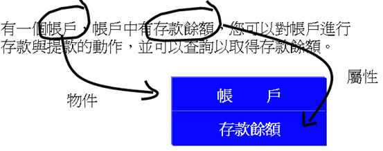
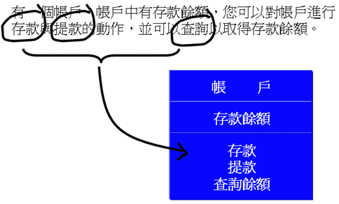
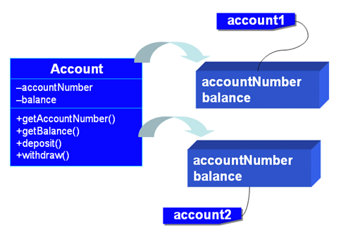
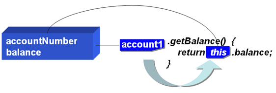

第 7 章 封裝（Encapsulation）
============================

從這個章節開始，您將逐步學習如何使用Java在「物件導向」（Object-oriented）上的語法支援，以進行物件導向程式設計，在此之前請先記得一個觀念：「學會一個支援物件導向的程式語言（如 Java）與學會物件導向（程式設計）觀念完全是兩碼子事。」物件導向是一種對問題的思考方式，與任何的程式語言沒有任何直接的關係，物件導向也絕不僅用於程式設計領域。

物件導向可以作為一門學科來討論，要理解並應用它並不容易，更不是在幾個章節內就可以詳細說明的，如果您沒有接觸過物件導向，光是討論觀念會過於抽象，「從實作中學習」會是比較好的方式，所以我會在說明 Java 對物件導向上的支援語法時，同時說明一些物件導向的入門觀念，首先第一步是瞭解如何使用 Java 來描述物件的特性，對物件資訊進行「封裝」（Encapsulation），也就是定義「類別」（Class）。

----------

7.1 定義類別（Class）
---------------------

以物件導向的思維來思考一個問題的解答時，會將與問題相關的種種元素視作一個個的物件，問題的發生是由物件的交互所產生，而問題的解答也由某些物件彼此合作來完成。所以如何描述問題中的各種元素？如何將這些元素定義為物件？也就是如何封裝物件資訊就是物件導向設計的第一步。您要瞭解如何使用「類別」（Class）定義物件，類別是建構物件時所依賴的規格書。

## 7.1.1 以物件思考問題

簡單的說，物件導向的思維就是以物件為中心來思考問題，然而什麼又叫作「以物件為中心來思考問題」？我不想用太多抽象的字眼來解釋這些詞語，這邊實際提出一個問題，並嘗試以物件導向的方式來思考問題。

    有一個帳戶，帳戶中有存款餘額，您可以對帳戶進行存款與提款的動作，並可以查詢以取得存款餘額。
    
要以物件為中心來思考問題，首先要識別出問題中的物件，以及物件上的屬性與可操作的方法：

- 識別問題中的物件與屬性

  帳戶是個比較單純的問題，可以從問題中出現的名詞來識別出物件，描述中有「帳戶」與「餘額」兩個名詞，基本上兩個名詞都可以識別成物件，然而在這個簡單的問題當中，設計的粒度還不需要這麼細，所以您先識別「帳戶」這個物件。

  識別出物件之後，接下來看看物件上有什麼屬性（Property），像是物件上擁有什麼特徵或是可表示的狀態（State），屬性是物件上的靜態特性。屬性基本上也可以從名詞上識別，在這個例子中，您可以將「餘額」作為帳戶的屬性之一。
  
  
  
  圖 7.1 識別出物件與屬性

- 識別物件上的方法

  接著要識別物件上的方法，也就是識別物件上的動態特性，也就是物件本身可操作或供操作的介面，問題描述上的動詞可能就可以識別為方法，例如「存款」、「提款」、「查詢餘額」等動作，就可以識別為物件上的方法。
  
    
  
    圖 7.2 識別物件方法

  識別出物件及其上的屬性與方法之後，您就有了基本的物件定義書，接著您就可以實際從定義書中產生物件實例，並以這些物件實例設計彼此間的交互行為以解決問題。

    
  
    圖 7.3 從物件定義書中產生物件實例

  如何為這些物件實例設計交互行為，依應用的領域不同而有所差異，就 Java 程式設計而言，就是使用 Java 的語法來為這些物件來進行各種條件判斷與流程控制，接著運行程式以獲得解答。

> **良葛格的話匣子** 以上是很簡單的物件分析過程，目的在讓您對物件導向分析有大致的瞭解，對於真正所面臨的問題，實際的物件分析會再複雜一些，例如單純從問題中的名詞來識別物件就不一定行的通了，這與「物件導向分析」（Object-oriented Analysis）有關，如果您想進一步瞭解物件導向分析，建議看看這本書：
>
>	Applying UML and Patterns: An Introduction to Object-Oriented Analysis and Design and the Unified Process, Second Edition	By Craig Larman

## 7.1.2 使用 class 定義類別

在物件導向設計中，物件並不會憑空產生，您必須識別出問題中的物件，並對這些物件加以定義，您要定義一個規格書，在 Java 中這個規格書稱之為「類別」（Class），您使用類別定義出物件的規格書，之後根據類別來建構出一個個的物件，然後透過物件所提供的操作介面來與程式互動。

在 Java 中使用 "class" 關鍵字來定義類別，使用類別來定義一個物件（Object）時，會考慮這個物件可能擁有的「屬性」（Property）與「方法」（Method）。屬性是物件的靜態表現，而方法則是物件與外界互動的動態操作。

舉個例子來說，若您的問題中會有「帳戶」這個物件，在分析了您的問題之後，您為「帳戶」這個物件定義了 Account 類別。

#### **範例 7.1  Account.java**
```java
public class Account {
    private String accountNumber;
    private double balance;

    public Account() {
        this("empty", 0.0);
    }

    public Account(String accountNumber, double balance) {
        this.accountNumber = accountNumber;
        this.balance = balance;
    }

    public String getAccountNumber() {
        return accountNumber;
    }

    public double getBalance() {
        return balance;
    }

    public void deposit(double money) {
        balance += money;
    }

    public double withdraw(double money) {
        balance -= money;
        return money;
    }
} 
```

在這邊先大致呈現出一個類別所可能具備的元素並加以簡介，稍後對每個元素會詳加介紹：

- 定義類別

  首先看到範例中的"class"，這是Java中用來定義類別的關鍵字，記得一個類別的定義是這麼作的：
  
  <pre>public class Account { 
      // 實作內容 
  }</pre>
  
  Account 是您為類別取的名稱，由於這個類別使用 "public" 關鍵字加以修飾，所以檔案的主檔名必須與類別名稱相同，也就是檔案要取名為 "Account.java"，這是規定，在一個檔案中可以定義數個類別，但只能有一個類別被設定為 "public"，檔案名稱主檔名必須與這個 public 的類別同名，例如 Account.java 中可以有以下的內容：
  
  </pre>public class Account { // 檔案必須是Account.java
      // 實作內容 
  }
  class SomeClass {
      //實作內容
  }
  class OtherClass {
      //實作內容
  }</pre> 

- 定義成員

  在類別中的資料及互動方法，統稱其為「類別成員」（Class member），範例 7.1 中的 accountNumber、balance 成員是「資料成員」（Field member），getAccountNumber() 與 getBalance() 是「方法成員」（Method member），在定義資料成員時可以指定初值，如果沒有指定初值，則會有預設值，資料成員如果是基本型態，則預設值與表 5.1 所列出的相同，如果是物件型態，則預設值為 null，也就是不參考任何的物件。
  
  注意到 "public" 這個關鍵字，這表示所定義的成員可以使用宣告的物件名稱加上 '.' 運算子來直接呼叫，也稱之為「公用成員」或「公開成員」。"private" 這個關鍵字用來定義一個「私用成員」，私用成員不可以透過參考名稱加上"."直接呼叫，又稱之為「私有成員」。
  
  在定義類別時，有一個基本原則是：資訊的最小化公開。也就是說儘量透過方法來操作物件，而不直接存取物件內部的資料成員（也就是 Field 成員）。資訊的最小化公開原則是基於安全性的考量，避免程式設計人員隨意操作內部資料成員而造成程式的錯誤，您可以在日後的程式設計中慢慢來體會；在稍後的實作中，您將看到我不會對 accountNumber 與 balance 兩個私用成員直接存取，而會透過公開的方法來對它們進行設定。 
  
  一個類別中的資料成員，若宣告為 "private"，則其可視範圍（Scope）為整個類別內部，由於外界無法直接存取私用成員，所以您要使用兩個公開方法 getAccountNumber() 與 getBalance() 分別傳回其這兩個成員的值。

- 定義建構方法

  與類別名稱同名的方法稱之為「建構方法」（Constructor），也有人稱之為「建構子」，它沒有傳回值，建構方法的作用是讓您建構物件的同時，可以同時初始一些必要的資訊，建構方法可以被「重載」（Overload），以滿足物件生成時各種不同的初始需求，在範例 7.1 中您重載了建構方法，在不指定引數的情況下，會將 balance 設定為 0.0，而 accountNumber 設定為 "empty"，另一個建構方法則可以指定引數，this() 方法用於物件內部，表示呼叫物件的建構方法，另一個關鍵字就是 "this"，它參考至物件本身，7.1.5 會再詳細介紹 "this" 以進一步瞭解其作用。
  
  定義好 Account 類別之後，您就可根據這個類別來建構物件，也就是產生 Account 類別的實例，建構物件時要使用 "new" 關鍵字，顧名思義，就是根據所指定的類別（規格書）「新建」一個物件：

  <pre>Account account1 = new Account(); 
  Account account2 = new Account("123-4567", 100.0);</pre>
  
  在上面的程式片段中宣告了 account1 與 account2 兩個 Account 型態的參考名稱，並讓它們分別參考至物件，account1 所參考的物件在建立時並不指定任何引數，所以根據之前對 Account 類別的定義，account1 所參考物件的 balance 將設定為 0.0，accountNumber 設定為 "empty"；accont2 所參考的物件在新建時則給定兩個引數，所以 account2 所參考物件的 balance 設定為 100.0，而 accountNumber 設定為 "empty"。
  
  要透過公開成員來操作物件或取得物件資訊的話，可以在物件名稱後加上「.」運算子來進行，例如： 
  <pre>account1.getBalance(); 
  account1.deposit(1000.0);</pre>
  
範例 7.2 綜合以上的介紹來作個簡單的練習，要使用到範例 7.1 中的 Account 類別。

#### **範例 7.2  AccountDemo.java**
```java
public class AccountDemo { 
    public static void main(String[] args) {
        Account account = new Account();
        System.out.println("帳戶: " + account.getAccountNumber()); 
        System.out.println("餘額: " + account.getBalance()); 

        account = new Account("123-4567", 100.0);
        account.deposit(1000.0);
        System.out.println("帳戶: " + account.getAccountNumber()); 
        System.out.println("餘額: " + account.getBalance()); 
    } 
}
```

Account.java 與 AccountDemo.java 都要編譯，然後執行程式，結果如下：

    帳戶: empty
    餘額: 0.0
    帳戶: 123-4567
    餘額: 1100.0

> **良葛格的話匣子** 類別與物件這兩個名詞會經常混於書籍與文件之中，例如「您可以使用 Scanner類別」、「您可以使用 Scanner 物件」，這兩句在某些場合其意思可能是相同的，不過要細究的話，兩句的意思通常都是「您可以使用根據 Scanner 類別所建構出來的物件」，不過寫這麼長很煩，難免就省略了一些字眼。

## 7.1.3 類別成員（Class member）

在 Java 中，一個類別可以定義資料成員（Field）及方法（Method） 成員，在 Java 中，類別成員可用的存取權限修飾詞有 "public"、"protected"、"private" 三個，如果在宣告成員時不使用存取修飾詞，則預設以「套件」（package）為存取範圍，也就是說在 package 外就無法存取，關於 package 與存取修飾的關係，在第 9 章還會見到說明。

以範例 7.1 為例來進行說明。在該範例中，您定義了一個 Account 類別，當中還定義了 accountNumber 與 balance 兩個資料成員，這兩個資料成員被宣告為 "private"，表示它是 「私用成員」（Private member），私用成員只能在 Account 類別中被使用，不可以直接藉由物件的參考名稱加上 "." 來直接存取它。

再來看到方法（Method）成員，範例 7.1 的每一個方法被宣告為 "public"，表示這些方法可以藉由物件的參考名稱加上 "." 直接呼叫，一個方法成員為一小個程式片段或一個執行單元（Unit），這個程式片段可重複被呼叫使用，並可傳入引數或傳回一個表示執行結果的數值，一個方法成員的基本宣告與定義方式如下 ：

    存取修飾 傳回值型態 方法名稱(參數列) {
    　　// 實作 
    　　return 傳回值; 
    }

參數列用來傳入方法成員執行時所需的資料，如果傳入的引數是基本資料型態（Primitive data type），則會將值複製至參數列上的參數，如果傳入的引數是一個物件，則會將參數列上宣告的參數參考至指定的物件。

方法區塊中可以宣告變數（Variable），參數在方法區塊執行結束後就會自動清除，如果方法中宣告的變數名稱與類別資料成員的名稱同名，則方法中的變數名稱會暫時覆蓋資料成員的作用範圍；參數列上的參數名稱也會覆蓋資料成員的作用範圍，如果此時要在方法區塊中使用資料成員，可以使用 "this" 關鍵字來特別指定，範例 7.3 可以印證這個說明。

#### **範例 7.3  MethodMember.java**
```java
public class MethodMember {
    public static void main(String[] args) {
        MethodDemo methodDemo = new MethodDemo();
        
        methodDemo.scopeDemo(); // 對data 資料成員不會有影響
        System.out.println(methodDemo.getData());

        methodDemo.setData(100); // 對data 資料成員不會有影響
        System.out.println(methodDemo.getData());
    }
}

class MethodDemo {
    private int data = 10;

    public void scopeDemo() { // void 表示沒有傳回值
        int data = 100;
    }

    public int getData() {
        return data;
    }

    public void setData(int data) { // void 表示沒有傳回值
        data = data; // 這樣寫是沒用的
        // 寫下面這個才有用
        // this.data = data;
    }
}
```

執行結果：

    10
    10

方法的傳回值可以將計算的結果或其它想要的數值、物件傳回，傳回值與傳回值型態的宣告必須一致，在方法中如果執行到 "return" 陳述，則會立即終止區塊的執行；如果方法執行結束後不需要傳回值，則可以撰寫 "void"，且無需使用 "return" 關鍵字。

在物件導向程式設計的過程中，有一個基本的原則，如果資料成員能不公開就不公開，在 Java 中若不想公開成員的資訊，方式就是宣告成員為 "private"，這是「資訊的最小化」，此時在程式中要存取 "private" 成員，就要經由 setXXX() 與 getXXX() 等公開方法來進行設定或存取，而不是直接存取資料成員。

透過公開方法存取私用成員的好處之一是，如果存取私用成員的流程有所更動，只要在公開方法中修改就可以了，對於呼叫方法的應用程式不受影響，例如您的 Account 類別中，withdraw() 顯然的在餘額為 0 時，仍然可以提款，您必須對此做出修正：

    public double withdraw(double money) {
        if(balance – money < 0) {
            return 0;
        }
        else {
            balance -= money;
            return money;
        }   
    }
    
這麼一來，您的 withdraw() 對 balance 做了些檢查，但對於使用 Account 的 AccountDemo 來說，並不用做出修改。

在第 4 章中介紹過 autoboxing、unboxing，在方法的參數列中是可以作用的，也就是說如果您的方法中是這樣設計的：

    public class SomeClass {
        ....
        public void someMethod(Integer integer) {
            ......
        }
        ....
    }
    
則您可以使用這樣的方式來設定引數：

    SomeClass someObj = new SomeClass();
    someObj.someMethod(1); // autoboxing

> **良葛格的話匣子** 方法名稱的命名慣例為首字小寫，名稱以一目瞭解方法的作用為原則，以上所採取的都是駱駝式的命名方式，也就是每個單字的首字予以適當的大寫，例如 someMethodOfSomeClass() 這樣的命名方式。
>
> 為資料成員設定 setXXX() 或 getXXX() 存取方法時，XXX 名稱最好與資料成員名稱相對應，例如命名balance這個資料成員對應的方法時，可以命名為 setBalance() 與 getBalance()，而 accountNumber 這個成員，則可對應於 setAccountNumber() 與 getAccountNumber() 這樣的名稱，如此閱讀程式時可以一目瞭解方法的存取對象。

> 您搞得清楚「參數」（Parameter）與引數（Argument）嗎？在定義方法時，可以定義「參數列」，例如：
>
>  <pre>public void setSomething(int something) { // something 稱之為參數
>        // ...
> }</pre>
>
> 而呼叫方法時傳遞的數值或物件稱之為「引數」，例如：
>
> <pre>someObject.setSomething(10); // 10 是引數</pre>

## 7.1.4 建構方法（Constructor）

在定義類別時，您可以使用「建構方法」（Constructor）來進行物件的初始化，在 Java 中建構方法是與類別名稱相同的公開方法成員，且沒有傳回值，例如：

    public class SafeArray { 
        // .. 
        public SafeArray() {  // 建構方法 
            // .... 
        } 
        public SafeArray(參數列) {  // 
            // .... 
        } 
    }
    
在建構方法中，您可以定義無參數的或具有參數的建構方法，程式在運行時，會根據配置物件時所指定的引數資料型態等，來決定該使用哪一個建構方法新建物件，如果您沒有定義任何的建構方法，則編譯器會自動配置一個無參數且沒有陳述內容的建構方法。

在範例 7.4 示範了實作簡單的「安全的陣列」，您所定義的陣列類別可以動態配置陣列長度，並可事先檢查存取陣列的索引是否超出陣列長度，在這個陣列類別中，您還實作了幾個簡單的功能，像是傳回陣列長度、設定陣列元素值、取得陣列元素值等。

#### **範例 7.4  SafeArray.java**
```java
public class SafeArray { 
    private int[] arr; 
 
    public SafeArray() {
        this(10); // 預設 10 個元素
    }
 
    public SafeArray(int length) { 
        arr = new int[length]; 
    }
 
    public void showElement() {
        for(int i : arr) {
            System.out.print(i + " ");
        }
    }
 
    public int getElement(int i) { 
        if(i >= arr.length || i < 0) { 
            System.err.println("索引錯誤"); 
            return 0; 
        } 
 
        return arr[i]; 
    }
 
    public int getLength() { 
        return arr.length; 
    }
 
    public void setElement(int i, int data) { 
        if(i >= arr.length || i < 0) { 
            System.err.println("索引錯誤"); 
            return; 
        }
 
        arr[i] = data; 
    } 
}
```

如果您不指定引數的話，就會使用無參數的建構方法來配置 10 個元素的陣列，您也可以由指定的長度來配置陣列；您在無參數的建構方法中使用 this(10)，這會呼叫另一個有參數的建構方法，以避免撰寫一些重複的原始碼。範例 7.5 示範了如何使用自訂的安全陣列類別。

#### **範例 7.5  SafeArrayDemo.java**
```java
public class SafeArrayDemo { 
    public static void main(String[] args) { 
        // 預設10個元素 
        SafeArray arr1 = new SafeArray();  
         // 指定配置 5 個元素 
        SafeArray arr2 = new SafeArray(5);
 
        for(int i = 0; i < arr1.getLength(); i++) 
            arr1.setElement(i, (i+1)*10);

        for(int i = 0; i < arr2.getLength(); i++) 
            arr2.setElement(i, (i+1)*10);

        System.out.print("arr1: ");
        arr1.showElement();

        System.out.print("\narr2: ");
        arr2.showElement();
    }
} 
```

在範例 7.5 中您配置了兩個物件，一個使用預設的建構方法，所以 arr1 的陣列元素會有 10 個，一個使用指定長度的建構方法，所以 arr2 的陣列元素個數是您指定的5，建構方法依引數不同而自行決定該使用哪一個建構方法，執行結果如下：
    arr1: 10 20 30 40 50 60 70 80 90 100
    arr2: 10 20 30 40 50

## 7.1.5 關於 this

請您回顧一下範例 7.1，在範例的 Account 類別中定義有 accountNumber 與 balance 成員，當您使用 Account 類別新增兩個物件並使用 account1 與 account2 來參考時，account1 與 account2 所參考的物件會各自擁有自己的 accountNumber 與 balance 資料成員，然而方法成員在記憶體中會只有一份，當您使用 account1.getBalance() 與 account1.getBalance() 方法取回 balance 的值時，既然類別的方法成員只有一份，getBalance() 時如何知道它傳回的 balance 是 account1 所參考物件的 balance，還是 account2 所參考物件的 balance 呢？



圖 7.4 物件實例擁有自己的資料成員

其實您使用參考名稱來呼叫物件的方法成員時，程式會將物件的參考告知方法成員，而在方法中所撰寫的每一個資料成員其實會隱含一個 this 參考名稱，這個 this 名稱參考至呼叫方法的物件，當您呼叫 getBalance() 方法時，其實您相當於執行：

    public double getBalance() { 
        return this.balance; 
    } 
    
所以當使用account1並呼叫getBalance()方法時，this所參考的就是account1所參考的物件，而account2並呼叫getBalance()方法時，this所參考的就是account2所參考的物件，所以getBalance()可以正確的得知該傳回哪一個物件的balance 資料。



圖 7.5 this 參考至實際的物件

每一個類別的方法成員都會隱含一個 this 參考名稱，可用來指向呼叫它的物件，當您在方法中使用資料成員時，都會隱含的使用 this 名稱，當然您也可以明確的指定，例如在方法定義時使用：

    public Account(String accountNumber, double balance) {
        this.accountNumber = accountNumber;
        this.balance = balance;
    } 
    
參數名稱與資料成員名稱相同時，為了避免參數的作用範圍覆蓋了資料成員的作用範圍，您必須明確的使用 this 名稱來指定，但如果參數名稱與資料成員名稱不相同則不用特別指定，例如：

    public Account(String number, double money) {
        accountNumber = number; // 實際等於this.accountNumber = number;
        this.balance = money;  // 實際等於this.balance = money;
    }  
    
this 除了用來參考至呼叫方法的實際物件之外，還有一種可以帶引數的用法，主要是用於呼叫建構方法，而避免直接以建構方法的名稱來呼叫，例如在下面的程式片段中，當使用無參數的建構方法 Ball() 時，它會呼叫有參數的建構方法：

    public class Ball { 
        private String name; 

        public Ball() { 
            this("No name"); // 會使用Ball("No name")來建構
        }
 
        public Ball(String name) { 
            this.name = name; 
            .... 
        } 
    } 

> **良葛格的話匣子** 很多時候會經常這麼說：「account1 物件可以作 xxx 動作...」或是「account2 物件的 xxx 方法...」，其實意思指的是：「account1 所參考物件可以作 xxx 動作...」、「account2 所參考物件的 xxx 方法」，只不過每次都要這麼寫的話，會讓文件內容又臭又長，所以就都簡略的用 account1、account2 來代表物件了，但您自己要記得像 account1、account2 這樣的名稱，其目的是參考至實際的物件，這邊是因為要說明 this 的作用，所以要寫的詳細一些。

## 7.1.6 關於 static

對於每一個基於相同類別所產生的物件而言，它們會擁有各自的資料成員，然而在某些時候，您會想要這些物件擁有共享的資料成員，舉個例子來說，如果您設計了一個 Ball 類別，當中打算使用到圓周率PI這個資料，因為對於任一個 Ball 的實例而言，圓周率都是相同的，您不需要讓不同的 Ball 實例擁有各自的圓周率資料成員。

您可以將 PI 資料成員宣告為 "static"，被宣告為 "static" 的資料成員，又稱「靜態資料成員」，靜態成員是屬於類別所擁有，而不是個別的物件，您可以將靜態成員視為每個物件實例所共享的資料成員。要宣告靜態資料成員，只要在宣告資料成員時加上 "static" 關鍵字就可以了，例如：

    public class Ball { 
        public static double PI = 3.14159; // 宣告static資料
        ...
    }
    
靜態成員屬於類別所擁有，可以在不使用名稱參考下，直接使用類別名稱加上'.'運算子來存取靜態資料成員，不過靜態資料成員同樣遵守 "public"、"protected" 與 "private" 的存取限制，所以若您要直接存取靜態資料成員，必須注意它的權限，例如必須設定為 "public" 成員的話就可以如下存取：

    System.out.println("PI = " + Ball.PI);
    
雖然您也可以在宣告物件之後，透過物件名稱加上 '.' 運算子來存取靜態資料成員，但是這個方式並不被鼓勵，通常建議使用類別名稱加上 '.' 運算子來存取，一方面也可以避免與非靜態資料成員混淆，例如下面的方式是不被鼓勵的：

    Ball ball = new Ball();
    System.out.println("PI = " + ball.PI);
    
與靜態資料成員類似的，您也可以宣告方法成員為 "static" 方法，又稱「靜態方法」，被宣告為靜態的方法通常是作為工具方法，例如在 Ball 類別上增加一個角度轉徑度的方法 toRadian()：

    public class Ball { 
        ...
        public static double toRadian(double angle) {
             return 3.14159 / 180 * angle;
        }
    }
    
與靜態資料成員一樣的，您可以透過類別名稱使用'.'運算子來存取 "static" 方法，當然要注意權限設定，例如設定為 "public" 的話可以如下存取：

    System.out.println("角度90等於徑度" + Ball.toRadian (90)); 
    
靜態資料與靜態方法的作用通常是為了提供共享的資料或工具方法，例如將數學常用常數或計算公式，以 "static" 宣告並撰寫，之後您可以把這個類別當作工具類別，透過類別名稱來管理與取用這些靜態資料或方法，例如像 Java SE 所提供的 Math 類別上，就有 Math.PI 這個靜態常數，以及 Math.Exp()、Math.Log()、Math.Sin() 等靜態方法可以直接使用，另外還有像 Integer.parseInt()、Integer. MAX_VALUE 等也都是靜態方法與靜態資料成員的實際例子。

由於靜態成員是屬於類別而不是物件，所以當您呼叫靜態方法時，並不會傳入物件的參考，所以靜態方法中不會有 this 參考名稱，由於沒有 this 名稱，所以在 Java 的靜態方法中不允許使用非靜態成員，因為沒有 this 來參考至物件，也就無法辨別要存取的是哪一個物件的成員，事實上，如果您在靜態方法中使用非靜態資料成員，在編譯時就會出現以下的錯誤訊息：

    non-static variable test cannot be referenced from a static context

或者是在靜態方法中呼叫非靜態方法，在編譯時就會出現以下的錯誤訊息：

    non-static method showHello() cannot be referenced from a static context

在 Java 中程式進入點（Entry point）的 main() 方法就是靜態方法，如果您要直接在main()中呼叫其它的方法，則該方法就必須是靜態方法，像範例 7.6 所示範的。

#### **範例 7.6  StaticDemo.java**
```java
public class StaticDemo {
    public static void sayHello() {
        System.out.println("哈囉！");
    }

    public static void main(String[] args) {
        sayHello();
    }
}
```

您可以試著將 sayHello() 前的 "static" 消掉，編譯時就會發生上述的第二個錯誤訊息。

Java 在使用到類別時才會載入類別至程式中，如果在載入類別時，您希望先進行一些類別的初始化動作，您可以使用 "static" 定義一個靜態區塊，並在當中撰寫類別載入時的初始化動作，例如：

    public class Ball { 
        static { 
            // 一些初始化程式碼 
        } 
        .... 
    }
    
在類別被載入時，預設會先執行靜態區塊中的程式碼，且只會執行一次，實際使用範例來說明一下，首先撰寫範例 7.7 的 SomeClass 類別。

#### **範例 7.7  SomeClass.java**
```java
public class SomeClass {
    static {
        System.out.println("類別被載入");
    }
}
```

這個類別只定義了靜態區塊，主要是為了測試類別被載入時是否執行該區塊，接著撰寫測試程式，如範例 7.8 所示。

#### **範例 7.8  StaticBlockDemo.java**
```java
public class StaticBlockDemo {
    public static void main(String[] args) {
        SomeClass c = new SomeClass();
    }
}
```

在使用 "new" 來建立 SomeClass 的實例時，SomeClass 類別會被載入，載入之後預設會執行靜態區塊的內容，所以程式的執行結果如下所示：

    類別被載入
    
7.2 關於方法
------------

待續 ...