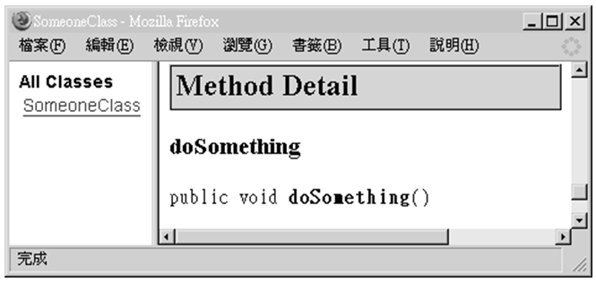
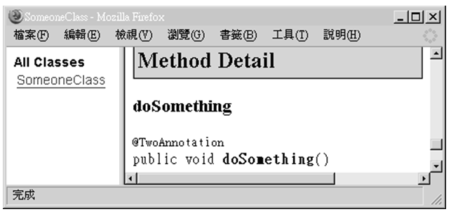

第 17 章 Annotation
===================

J2SE 5.0 中對 metadata 提出的功能是 Annotation，metadata 就是「資料的資料」（Data about data），突然看到這樣的解釋會覺得奇怪，但以表格為例，表格中呈現的就是資料，但有時候還會有額外的資料用來說明表格的作用，從這個角度來看，metedata 就不這麼的奇怪。

在 J2SE 5.0 中，Annotation 的主要目的介於原始碼與 API 文件說明之間，Annotation 對程式碼作出一些說明與解釋，Class 中可以包含這些解釋，編譯器或其它程式分析工作可以使用 Annotation 來作分析，您可以從 java.lang.Override、java.lang.Deprectated、java.lang.SuppressWarnings 這三個 J2SE 5.0 中標準的 Annotation 型態開始瞭解 Annotation 的作用。

-------------

17.1 Annotation
---------------

Annotation 對程式運行沒有影響，它的目的在對編譯器或分析工具說明程式的某些資訊，您可以在套件、類別、方法、資料成員等加上 Annotation，每一個 Annotation 對應於一個實際的 Annotation 型態，您可以從 java.lang.Override、java.lang.Deprectated、java.lang.SuppressWarnings 這三個 J2SE 5.0 中標準的 Annotation 型態開始瞭解 Annotation 的作用，這個小節也將告訴您如何自訂 Annotation 型態。

## 17.1.1 限定 Override 父類方法 @Override

java.lang.Override 是 J2SE 5.0 中標準的 Annotation 型態之一，它對編譯器說明某個方法必須是重新定義父類別中的方法，編譯器得知這項資訊後，在編譯程式時如果發現被 @Override 標示的方法並非重新定義父類別中的方法，就會回報錯誤。

舉個例子來說，如果您在定義新類別時想要重新定義 Object 類別的 toString() 方法，您可能會寫成這樣：

    public class CustomClass {
        public String ToString() {
            return "customObject";
        }
    } 
    
在撰寫 toString() 方法時，您因為打字錯誤或其它的疏忽，將之打成 ToString() 了，您編譯這個類別時並不會出現任何的錯誤，編譯器不會知道您是想重新定義 toString() 方法，只會當您是定義了一個新的 ToString() 方法。

您可以使用 java.lang.Override 這個 Annotation 型態，在方法上加上一個 @Override的Annotation，這可以告訴編譯器您現在定義的這個方法，必須是重新定義父類別中的同名方法。

#### **範例 17.1  CustomClass.java**
```java
package onlyfun.caterpillar;

public class CustomClass {
    @Override
    public String ToString() {
        return "customObject";
    }
}
```

在編譯程式時，編譯器看到 @Override 這個 Annotation，瞭解到必須檢查被標示的方法是不是重新定義了父類別的 ToString() 方法，但父類別中並沒有 ToString() 這個方法，所以編譯器會回報錯誤：

    CustomClass.java:4: method does not override a method from its superclass
        @Override
        ^
    1 error
    
重新修改一下範例 17.1 中的 ToString() 為 toString()，編譯時就不會有問題了。

#### **範例 17.2  CustomClass2.java**
```
package onlyfun.caterpillar;

public class CustomClass2{
    @Override
    public String toString() {
        return "customObject";
    }
}
```

java.lang.Override 是個 Marker annotation，簡單的說就是用於標示的 Annotation，Annotation 名稱本身即表示了要給工具程式的資訊，例如 Override 這個名稱告知編譯器，被 @Override 標示的方法必須是重新定義父類別中的同名方法。

> **良葛格的話匣子** 「Annotation 型態」與「Annotation」實際上是有所區分的，Annotation 是 Annotation 型態的實例，例如 @Override 是個 Annotation，它是 java.lang.Override 型態的一個實例，一個文件中可以有很多個 @Override，但它們都是屬於 java.lang.Override 型態。

## 17.1.2 標示方法為 Deprecated @Deprectated

java.lang.Deprectated 是 J2SE 5.0 中標準的 Annotation 型態之一，它對編譯器說明某個方法已經不建議使用，如果有開發人員試圖使用或重新定義被 @Deprecated 標示的方法，編譯器必須提出警示訊息。

舉個例子來說，您可能定義一個 Something 類別，並在當中定義有 getSomething() 方法，而在這個類別被實際使用一段時間之後，您不建議開發人員使用 getSomething() 方法了，並想要將這個方法標示為 "deprectated"，您可以使用 @Deprectated 在 getSomething() 方法加上標示。

#### **範例 17.3  Somethingjava**
```java
package onlyfun.caterpillar;

public class Something {
    @Deprecated public Something getSomething() {
        return new Something();
    }
}
```

如果有人試圖在繼承這個類別後重新定義 getSomething() 方法，或是在程式中呼叫使用 getSomething() 方法，則編譯時會有警訊出現，例如範例 17.4。

#### **範例 17.4  SomethingDemo.java**
```java
package onlyfun.caterpillar;

public class SomethingDemo {
    public static void main(String[] args) {
        Something some = new Something();
        // 呼叫被@Deprecated標示的方法
        some.getSomething();
    }
}
```

編譯範例 17.4 時，就會出現以下的警訊：

    Note: SomethingDemo.java uses or overrides a deprecated API.
    Note: Recompile with -Xlint:deprecation for details.
    
想要知道詳細的警訊內容的話，可以在編譯時加上 -Xline:deprecation 引數，編譯器會告訴您是因為您使用了某個被 @Deprecated 標示了的方法而提出警訊，加上 -Xline:deprecation 引數顯示的完整訊息如下：

    javac -Xlint:deprecation -d . SomethingDemo.java
    SomethingDemo.java:6: warning: [deprecation] getSomething() in 
    onlyfun.caterpillar.Something has been deprecated
            some.getSomething();
            ^
    1 warning
    
java.lang.Deprecated 也是個 Marker annotation，簡單的說就是用於標示，Annotation 名稱本身即包括了要給工具程式的資訊，例如 Deprecated 這個名稱在告知編譯器，被 @Deprecated 標示的方法是一個不建議被使用的方法，如果有開發人員不小心使用了被 @Deprecated 標示的方法，編譯器要提出警訊提醒開發人員。

## 17.1.3 抑制編譯器警訊 @SuppressWarnings

java.lang.SuppressWarnings 是 J2SE 5.0 中標準的 Annotation 型態之一，它對編譯器說明某個方法中若有警示訊息，則加以抑制，不用在編譯完成後出現警訊，不過事實上這個功能在 Sun JDK 5.0 中沒有實現出來。

在這邊說明 @SuppressWarnings 的功能，考慮範例 17.5 的 SomeClass 類別。

#### **範例 17.5  SomeClass.java**
```java
package onlyfun.caterpillar;

import java.util.*;

public class SomeClass {
    public void doSomething() {
        Map map = new HashMap();
        map.put("some", "thing");
    }
}
```

由於在 J2SE 5.0 中加入了集合物件的泛型功能，並建議您明確的指定集合物件中將內填的物件之型態，但在範例 17.5 的 SomeClass 類別中使用 Map 時並沒有指定內填物件之型態，所以在編譯時會出現以下的訊息：

    Note: SomeClass.java uses unchecked or unsafe operations.
    Note: Recompile with -Xlint:unchecked for details.

在編譯時一併指定 -Xlint:unchecked 可以看到警示的細節：

    javac -Xlint:unchecked -d . SomeClass.java
    SomeClass.java:8: warning: [unchecked] unchecked call to put(K,V) 
    as a member of the raw type java.util.Map
            map.put("some", "thing");
                   ^
    1 warning

如果您想讓編譯器忽略這些細節，則可以使用 @SuppressWarnings 這個 Annotation。

#### **範例 17.6  SomeClass2.java**
```java
package onlyfun.caterpillar;

import java.util.*;

public class SomeClass2 {
    @SuppressWarnings(value={"unchecked"})
    public void doSomething() {
        Map map = new HashMap();
        map.put("some", "thing");
    }
}
```

這麼一來，編譯器將忽略掉 "unckecked" 的警訊，您也可以指定忽略多個警訊：

    @SuppressWarnings(value={"unchecked", "deprecation"})

@SuppressWarnings 為所謂的 Single-value annotation，因為這樣的 Annotation 只有一個成員，稱為 value 成員，可在使用 Annotation 時作額外的資訊指定。

## 17.1.4 自訂 Annotation 型態

您可以自訂 Annotation 型態，並使用這些自訂的 Annotation 型態在程式碼中使用 Annotation，這些 Annotation 將提供資訊給您的程式碼分析工具。

首先來看看如何定義 Marker Annotation，也就是 Annotation 名稱本身即提供資訊，對於程式分析工具來說，主要是檢查是否有 Marker Annotation 的出現，並作出對應的動作。要定義一個 Annotation 所需的動作，就類似於定義一個介面（interface），只不過您使用的是 @interface，範例 17.7 定義一個 Debug Annotation 型態。

#### **範例 17.7  Debug.java**
```java
package onlyfun.caterpillar;

public @interface Debug {}
```

由於是個 Marker Annotation，所以沒有任何的成員在 Annotation 定義當中，編譯完成後，您就可以在程式碼中使用這個 Annotation 了，例如：

    public class SomeObject {
        @Debug
        public void doSomething() {
            // ....
        }
    }
    
稍後可以看到如何在 Java 程式中取得 Annotation 資訊（因為要使用 Java 程式取得資訊，所以還要設定 meta-annotation，稍後會談到），接著來看看如何定義一個 Single-value annotation，它只有一個 value 成員，範例 17.8 是個簡單的示範。

#### **範例 17.8  UnitTest.java**
```java
package onlyfun.caterpillar;

public @interface UnitTest {
     String value();
}
```

實際上您定義了 value() 方法，編譯器在編譯時會自動幫您產生一個 value 的資料成員，接著在使用 UnitTest Annotation 時要指定值，例如：

    public class MathTool {
        @UnitTest("GCD")
        public static int gcdOf(int num1, int num2) {
            // ....
        }
    }
    
@UnitTest("GCD") 實際上是 @UnitTest(value="GCD) 的簡便寫法，value 也可以是陣列值，例如定義一個 FunctionTest 的 Annotation 型態。

#### **範例 17.9  FunctionTest.java**
```java
package onlyfun.caterpillar;

public @interface FunctionTest {
     String[] value();
}
```

在使用範例 17.9 所定義的 Annotation 時，可以寫成 @FunctionTest({"method1", "method2"}) 這樣的簡便形式，或是 @FunctionTest(value={"method1", "method2"}) 這樣的詳細形式，您也可以對 value 成員設定預設值，使用 "default" 關鍵字即可。

#### **範例 17.10  UnitTest2.java**
```java
package onlyfun.caterpillar;

public @interface UnitTest2 {
     String value() default "noMethod";
}
```

這麼一來如果您使用 @UnitTest2 時沒有指定 value 值，則 value 預設就是 "noMethod"。
您也可以為 Annotation 定義額外的成員，以提供額外的資訊給分析工具，範例 17.11 定義使用列舉型態、String 與 boolean 型態來定義 Annotation 的成員。

#### **範例 17.11  Process.java**
```java
package onlyfun.caterpillar;

public @interface Process {
    public enum Current {NONE, REQUIRE, ANALYSIS, DESIGN, SYSTEM};

    Current current() default Current.NONE;
    String tester();
    boolean ok();
}
```

您可以如範例 17.12 使用範例 17.11 定義的 Annotation 型態。

#### **範例 17.12  Application.java**
```java
package onlyfun.caterpillar;

public class Application {
    @Process(
       current = Process.Current.ANALYSIS,
       tester = "Justin Lin",
       ok = true
    )
    public void doSomething() {
        // ....
    }
}
```

當您使用 @interface 自行定義 Annotation 型態時，實際上是自動繼承了 java.lang.annotation.Annotation 介面，並由編譯器自動為您完成其它產生的細節，並且在定義 Annotation 型態時，不能繼承其它的 Annotation 型態或是介面。

定義 Annotation 型態時也可以使用套件機制來管理類別，由於範例所設定的套件都是 onlyfun.caterpillar，所以您可以直接使用 Annotation 型態名稱而不指定套件名，但如果您是在別的套件下使用這些自訂的 Annotation，記得使用 import 告訴編譯器型態的套件位置，例如：

    import onlyfun.caterpillar.Debug;
    public class Test {
        @Debug
        public void doTest() {
        }
    }
    
或是使用完整的 Annotation 名稱，例如：

    public class Test {
        @onlyfun.caterpillar.Debug
        public void doTest() {
        }
    }
    
17.2 meta-annotation
---------------------

所謂 meta-annotation 就是 Annotation 型態的資料，也就是 Annotation 型態的 Annotation，在定義 Annotation 型態的時候，為 Annotation 型態加上 Annotation 並不奇怪，這可以為處理 Annotation 型態的分析工具提供更多的資訊。

## 17.2.1 告知編譯器如何處理 annotaion @Retention

java.lang.annotation.Retention 型態可以在您定義 Annotation 型態時，指示編譯器該如何對待您的自定義的 Annotation 型態，預設上編譯器會將 Annotation 資訊留在 .class 檔案中，但不被虛擬機器讀取，而僅用於編譯器或工具程式運行時提供資訊。

在使用 Retention 型態時，需要提供 java.lang.annotation.RetentionPolicy 的列舉型態，RetentionPolicy 的定義如下所示：

    package java.lang.annotation;
    public enum RetentionPolicy {
        SOURCE, // 編譯器處理完Annotation資訊後就沒事了
        CLASS,  // 編譯器將Annotation儲存於class檔中，預設
        RUNTIME // 編譯器將Annotation儲存於class檔中，可由VM讀入
    }
    
RetentionPolicy 為 SOURCE 的例子是 @SuppressWarnings，這個資訊的作用僅在編譯時期告知編譯器來抑制警訊，所以不必將這個資訊儲存於 .class 檔案。

RetentionPolicy 為 RUNTIME 的時機，可以像是您使用 Java 設計一個程式碼分析工具，您必須讓 VM 能讀出 Annotation 資訊，以便在分析程式時使用，搭配反射（Reflection）機制，就可以達到這個目的。

在 J2SE 5.0 新增了 java.lang.reflect.AnnotatedElement 這個介面，當中定義有四個方法：

    public Annotation getAnnotation(Class annotationType);
    public Annotation[] getAnnotations();
    public Annotation[] getDeclaredAnnotations();
    public boolean isAnnotationPresent(Class annotationType);

Class、Constructor、Field、Method、Package 等類別，都實作了 AnnotatedElement 介面，所以您可以從這些類別的實例上，分別取得標示於其上的 Annotation 與相關資訊，由於是在執行時期讀取 Annotation 資訊，所以定義 Annotation 時必須設定 RetentionPolicy 為 RUNTIME，也就是可以在 VM 中讀取 Annotation 資訊。

舉個例子來說，假設您設計了範例 17.13 的 Annotation。

#### **範例 17.13  SomeAnnotation.java**
```java
package onlyfun.caterpillar;

import java.lang.annotation.Retention;
import java.lang.annotation.RetentionPolicy;

@Retention(RetentionPolicy.RUNTIME)
public @interface SomeAnnotation {
    String value();
    String name();
}
```

由於 RetentionPolicy 為 RUNTIME，編譯器在處理 SomeAnnotation 時，會將 Annotation 及給定的相關訊息編譯至 .class 檔中，並設定為 VM 可以讀出 Annotation 資訊，接著您可以如範例 17.14 來使用 SomeAnnotation。

#### **範例 17.14  SomeClass3.java**
```java
package onlyfun.caterpillar;

public class SomeClass3 {
    @SomeAnnotation(
       value = "annotation value1",
       name = "annotation name1"
    )
    public void doSomething() {  
        // ....      
    }
}
```

現在假設您要設計一個原始碼分析工具來分析您所設計的類別，一些分析時所需的資訊您已經使用 Annotation 標示於類別中了，您可以在執行時讀取這些 Annotation 的相關資訊，範例 17.15 是個簡單的示範。

#### **範例 17.15  AnalysisApp.java**
```java
package onlyfun.caterpillar;

import java.lang.annotation.Annotation;
import java.lang.reflect.Method;

public class AnalysisApp {
    public static void main(String[] args) throws NoSuchMethodException {
        Class<SomeClass3> c = SomeClass3.class;

        // 因為SomeAnnotation標示於doSomething()方法上
        // 所以要取得doSomething()方法的Method實例
        Method method = c.getMethod("doSomething");

        // 如果SomeAnnotation存在的話
        if(method.isAnnotationPresent(SomeAnnotation.class)) {
            System.out.println("找到 @SomeAnnotation");
            // 取得SomeAnnotation
            SomeAnnotation annotation = 
                 method.getAnnotation(SomeAnnotation.class);
            // 取得value成員值
            System.out.println("\tvalue = " + annotation.value());
            // 取得name成員值
            System.out.println("\tname = " + annotation.name());
        }
        else {
            System.out.println("找不到 @SomeAnnotation");
        }

        // 取得doSomething()方法上所有的Annotation
        Annotation[] annotations = method.getAnnotations();
        // 顯示Annotation名稱
        for(Annotation annotation : annotations) {
            System.out.println("Annotation名稱：" +
                    annotation.annotationType().getName());
        }
    }
}
```

Annotation 標示於方法上的話，就要取得方法的 Method 代表實例，同樣的，如果 Annotation 標示於類別或套件上的話，就要分別取得類別的 Class 代表實例或是套件的 Package 代表實例，之後可以使用實例上的 getAnnotation() 等相關方法，以測試是否可取得 Annotation 或進行其它操作，範例 17.15 的執行結果如下所示：

    找到 @SomeAnnotation
            value = annotation value1
            name = annotation name1
    Annotation名稱：onlyfun.caterpillar.SomeAnnotation

## 17.2.2 限定 annotation 使用對象 @Target

在定義 Annotation 型態時，您使用 java.lang.annotation.Target 可以定義其適用之時機，在定義時要指定 java.lang.annotation.ElementType 的列舉值之一：

    package java.lang.annotation;
    public enum ElementType {
         TYPE, // 適用 class, interface, enum
         FIELD, // 適用 field
         METHOD, // 適用 method
         PARAMETER, // 適用 method 上之 parameter
         CONSTRUCTOR, // 適用 constructor
         LOCAL_VARIABLE, // 適用區域變數
         ANNOTATION_TYPE, // 適用 annotation 型態
         PACKAGE // 適用 package
    }
    
舉個例子來說，假設您定義 Annotation 型態時，想要限定它只能適用於建構方法與方法成員，則您可以如範例 17.16 的方式來定義。

#### **範例 17.16  MethodAnnotation.java**
```java
package onlyfun.caterpillar;

import java.lang.annotation.Target;
import java.lang.annotation.ElementType;

@Target({ElementType.CONSTRUCTOR, ElementType.METHOD})
public @interface MethodAnnotation {}
如果您嘗試將MethodAnnotation標示於類別之上，例如：
@onlyfun.caterpillar.MethodAnnotation
public class SomeoneClass {
    public void doSomething() {
        // ....      
    }
}
```

則在編譯時會發生以下的錯誤：

    SomeObject.java:1: annotation type not applicable to this kind of declaration
    @onlyfun.caterpillar.MethodAnnotation
    ^
    1 error
    
## 17.2.3 要求為 API 文件的一部份 @Documented

在製作 Java Doc 文件時，預設上並不會將 Annotation 的資料加入到文件中，例如您設計了以下的 OneAnnotation 型態：

    package onlyfun.caterpillar;
    public @interface OneAnnotation {}

然後將之用在以下的程式中：

    public class SomeoneClass {
        @onlyfun.caterpillar.OneAnnotation
        public void doSomething() {
            // ....      
        }
    }

您可以試著使用 javadoc 程式來產生 Java Doc 文件，您會發現文件中並不會有 Annotation 的相關訊息。



圖 17.1 預設 Annotation 不會記錄至 Java Doc 文件中

Annotation 用於標示程式碼以便分析工具使用相關資訊，有時 Annotation 包括了重要的訊息，您也許會想要在使用者製作 Java Doc 文件的同時，也一併將 Annotation 的訊息加入至 API 文件中，所以在定義 Annotation 型態時，您可以使用 java.lang.annotation.Documented，範例 17.17 是個簡單示範。

#### **範例 17.17  TwoAnnotation.java**
```java
package onlyfun.caterpillar;

import java.lang.annotation.Documented;
import java.lang.annotation.Retention;
import java.lang.annotation.RetentionPolicy;

@Documented
@Retention(RetentionPolicy.RUNTIME)
public @interface TwoAnnotation {}
```

使用 java.lang.annotation.Documented 為您定義的 Annotation 型態加上 Annotation 時，您必須同時使用 Retention 來指定編譯器將訊息加入 .class 檔案，並可以由 VM 讀取，也就是要設定 RetentionPolicy 為 RUNTIME，接著您可以使用這個 Annotation，並產生 Java Doc 文件，這次可以看到文件中包括了 @TwoAnnotation 的訊息。



圖 17.2 Annotation 記錄至 Java Doc 文件中

> **良葛格的話匣子** 您可以使用搜尋引擎找到一堆有關如何製作 Java Doc 文件的說明，您也可以參考Sun網站上的文章：
> 
> - http://java.sun.com/j2se/javadoc/writingdoccomments/

## 17.2.4 子類是否繼承父類的 annotation @Inherited

在您定義 Annotation 型態並使用於程式碼上後，預設上父類別中的 Annotation 並不會被繼承至子類別中，您可以在定義 Annotation 型態時加上 java.lang.annotation.Inherited 型態的 Annotation，這讓您定義的 Annotation 型態在被繼承後仍可以保留至子類別中。

#### **範例 17.18  ThreeAnnotation.java**
```java
package onlyfun.caterpillar;

import java.lang.annotation.Retention;
import java.lang.annotation.RetentionPolicy;
import java.lang.annotation.Inherited;

@Retention(RetentionPolicy.RUNTIME)
@Inherited
public @interface ThreeAnnotation {
    String value();
    String name();
}
您可以在下面這個程式中使用@ThreeAnnotation：
public class SomeoneClass {
    @onlyfun.caterpillar.ThreeAnnotation(
       value = "unit",
       name = "debug1"
    )
    public void doSomething() {  
        // ....      
    }
}
```

如果您有一個類別繼承了 SomeoneClass 類別，則 @ThreeAnnotation 也會被繼承下來。

17.3 接下來的主題
-----------------

每一個章節的內容由淺至深，初學者該掌握的深度要到哪呢？在這個章節中，對於初學者我建議至少掌握以下幾點內容：

- 會使用 @Override、@Deprectated、@SuppressWarnings
- 知道如何在 Java 程式中讀出 Annotation 資訊
 
下一個章節是個捨遺補缺的章節，也是本書的最後一個章節，當中說明了一些本書中有使用到但還沒有詳細說明的 API，另外我還介紹了簡單的訊息綁定，這讓您在配置程式的文字訊息時能夠更有彈性。


