# 第 19 章 專題製作 - 文字編輯器

在學習完一個程式語言的基本語法、API 的使用之後，若要驗收學習的成果，試著自己撰寫一個文字編輯器是個不錯的驗收方式，在這個章節中將一步步告訴您，如何組合前面18個章節中學習到的語法及 API 功能，實作出一個具讀取、儲存功能的視窗文字編輯器。

在這個章節中，您也將學到基本的 Swing 視窗程式設計，了解 Java 的視窗程式中容器（Container）、元件（Component）、版面管理員（Layout Manager）、事件（Event）與傾聽者（Listener）的基本觀念。

--------------

## 19.1 產品生命週期

在正式開發文字編輯器之前，先來看看一個應用程式的產品生命週期（Product Life Cycle, PLC）的幾個階段，在程式開發的過程中，並不是每個階段都要求嚴謹的執行完畢，哪個階段該採用？哪個階段該偏重？都是視應用程式的需求或規模不同而定，這個小節則先對這幾個階段作概略性的認識，並逐步勾勒出您所要開發的文字編輯器之輪廓。

### 19.1.1 分析（Analysis）

在程式開發的分析階段，其目的在於分析應用程式的需求為何？分析階段在釐清應用程式所想要解決的問題為何？以即將要開發的文字編輯器為例，您也許希望這個文字編輯器具有以下的功能：

- 具備視窗介面

  您必須決定使用者將如何操作您的文字編輯器，這要考量使用者在操作上的習慣，或是領域（Domain）特有的操作需求，操作介面設計良好與否，對一個產品是否受歡迎有相當大的影響，您可以觀察所要開發的程式是否有相類似的產品，看看該產品是如何設計操作介面的，對於簡單的文字編輯器之開發，可以參考Windows的「記事本」程式在介面上是如何設計的。
  
  您可以在紙上或繪圖軟體上，先設計出操作介面草稿，在設計介面的同時，也會大致勾勒出應用程式的部份功能，對於您將開發的文字編輯器，將具備以下的視窗介面：

  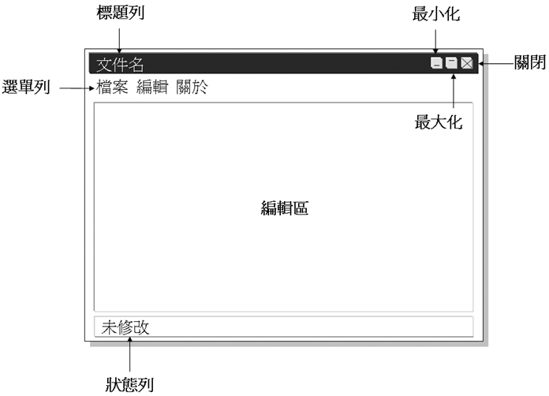

  圖 19.1 即將設計的文字編輯器主畫面

  應用程式介面上包括選單列，在選單列上按下各選單項目後，所出現的選單畫面如下：
  
  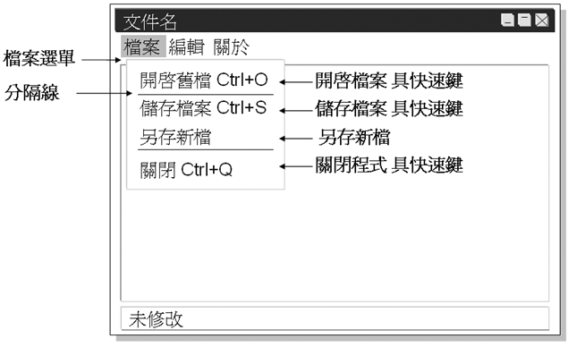

  圖 19.2 檔案選單畫面

  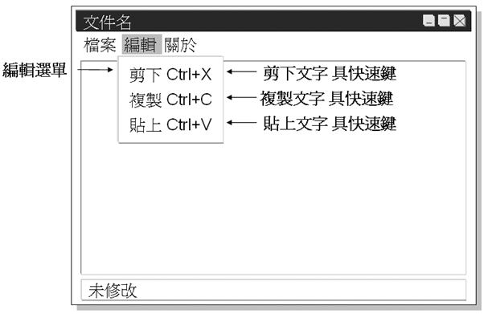

  圖 19.3 編輯選單畫面
  
  在檔案選單與編輯選單中還設計有快速鍵提示，例如您可以按下 Ctrl 鍵加上 O 字鍵來執行開啟舊檔的功能，而最後一個選單是「關於」選項，按下該選項後將出現程式版權宣告及程式相關說明：
  
  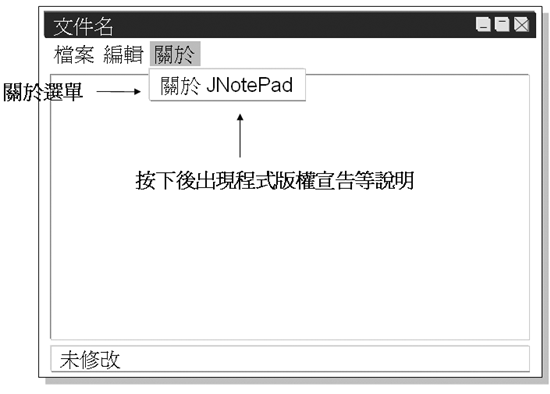

  圖 19.4 關於選單畫面
  
基於篇幅的限制，這邊不列出所有的視窗畫面設計圖，僅表示一下如何展現視窗介面的設計階段。

- 檔案的開啟與儲存

  在按下選單中的「開啟舊檔」後，會出現對話方塊以供您選取檔案，選定檔案之後會開啟該檔案並顯示檔案內容於文字編輯區中，並在標題列中顯示檔案名稱，如果檔案內容已有更動，又在此時執行「開啟檔案」，則提示使用者檔案已變動，請使用者確認是否儲存變更。
  
  在按下「儲存檔案」時，將文字編輯區中的文字儲存至標題列所指定的文件中，如果是以新檔案編輯文字，則出現提示儲存的對話方塊，讓使用者指定檔案名稱並儲存。
  
  在按下「另存新檔」時，將顯示儲存的對話方塊，讓使用者指定檔案名稱並儲存。
  
  儲存完文字之後，一律在「狀態列」顯示「未修改」字樣。
  
- 離開應用程式

  在按下「離開」時，若檔案已有更動，則提示使用者檔案已變動，請使用者確認是否儲存變更，之後離開應用程式，若檔案無變動，則直接離開應用程式。
  
- 編輯文字

  在選定文字後執行選單上的「剪下」指令，可以複製選定的文字並消除編輯區上的文字。
  
  執行「複製」指令，可以複製選定的文字。
  
  執行「貼上」指令，可以將剪下或複製的文字貼至文字編輯區。
  
  在文字編輯器有任何的文字編輯動作，將會在「狀態列」上顯示「已修改」的字樣。
  
以上所列出的是簡單的需求分析草稿，在實際的應用程式開發中，需求分析階段會儘可能的詳細，也會有制式的需求分析表格或需求規格書，需求分析人員可以一一檢定客戶的需求，詳盡的列出所有要求的功能，要完全補獲需求並不是件容易甚至不可能的事，需求可能會往返修改，在進入設計階段之前，要求的是盡量收集所有的需求，以降低在往後的階段中，由於需求變動所帶來的成本負擔。

### 19.1.2 設計（Design）

在進入設計階段之後將根據先前收集而來的需求分析，開始為應用程式規劃藍圖，這個階段將根據需求將應用程式切割出許多模塊，並設計出需求中所發掘出來的物件，您要為這些物件設計出交互行為，以完成應用程式所必須達成的功能，在設計階段通常還不會考慮到該使用何種語言與技術。

在這一個章節中所開發的文字編輯器是個簡單的應用程式，因而會直接將設計與開發同時併行，讓您可以從開發中體會設計的重要性。

> **良葛格的話匣子** 設計與開發同時併行也在實際的產品開發中使用，然而必須配合不斷的檢討與重構（Refactor），甚至配合測試來進行，這樣的方式避免了設計階段的過度設計，有許多程式開發人員也喜愛這種方式來開發程式。

### 19.1.3 開發（Development）

進入開發階段之後，將決定使用何種語言及技術來開發應用程式，在這個章節中，您將使用 Java 程式語言，並運用 Java SE 技術來開發文字編輯器，文字編輯器的介面將使用Swing視窗元件來開發，這也是這個章節所要著重的階段。

### 19.1.4 測試（Testing）

將完成的應用程式進行測試，以驗收其是否完成所期許的需求，並檢查程式中是否存在臭蟲（Bug），或是效能方面等的問題。

測試在現今的軟體開發中是一個日易受到重視的問題，各種的測試開發理論與實作文件不斷的被提出，對於這個章節來說，測試是個超出討論範圍的課題，有興趣的話，可以看看我的 [JUnit 筆記](http://openhome.cc/Gossip/JUnit/) 的內容，瞭解一些測試方面的技術與觀念。

### 19.1.5 完成（Implementation）

在程式開發測試無誤之後，接下來就是交付程式給客戶了，或者就是產品上線，對學生來說，也就是交給教授打分數了，無論如何，對於應用程式的開發人員來說，無疑是個最令人興奮的階段。

### 19.1.6 維護（Maintenance）

應用程式在交給客戶之後，會因為程式臭蟲、需求改變、需求增加、效能、安全問題等，而必須持續對程式進行維護、修正等工作，一個應用程式在維護階段的所規劃的時間並不一定，從一、兩年到幾十年都有可能，看應用程式的使用期限，或者是維護合約的簽定期限而定。

### 19.1.7　結束生命週期（End-of-life, EOL）

在產品不再符合使用的效益，或是版本更迭而造成應用程式不再適合等問題，應用程式都會有結束生命週期的時候，應用程式結束生命週期表示，即使可能仍有相當少數的人在使用該應用程式，但不再有公司、開發人員對其作出維護的工作，使用者使用結束生命週期的產品，將必須自行承擔一切的後果。

在整個應用程式生命週期中，這個章節將著重在分析、設計與開發實作的階段上，讓您知道如何使用 Java Swing 來完成視窗介面，如何使用 Java 語言及 Java SE 提供的類別來完成文字編輯器。

## 19.2 Swing 入門

若要使用 Java SE 來開發視窗應用程式，就本書撰寫的時間點來說可以有兩種選擇，一個是使用 AWT（Abstract Window Toolkit），另一個是使用 JFC（Java Foundation Classes）/Swing。您所要開發的文字編輯器將使用 Swing 技術，Swing 的使用可以很複雜，是個可以用專書介紹的技術，而這個小節的目的，在讓您於開發文字編輯器的介面，同時也可以掌握 Swing 設計的最基本要素，也就是容器（Container）、元件（Component）、版面管理員（Layout Manager）、事件（Event）與傾聽者（Listener）等基本觀念。

### 19.2.1 Swing 簡介

每一個視窗上所出現的元件在 Java SE 中，都是 java.awt.Component 或是 java.awt.MenuComponent 的子類別，Component 是按鈕（Button）、標籤（Label）、文字編輯元件（TextComponent）等類別的父類別，而 MenuComponent 則是選單列（MenuBar）、選單項目（MenuItem）等的父類別。

- Component 繼承體系

  Component 繼承體系下最重要的一個子類別就是 java.awt.Container 類別，Container 類別可以容納其它的 Component 在它之中，當然也可以容納其它的 Container，由此組合成更複雜的視窗畫面，在 Java SE 中 Container 有兩個主要的子類別：java.awt.Window 與 java.awt.Panel。
  
  Window 類別的實例是一個可以獨立存在的視窗，它包括了兩個重要的類別：java.awt.Dialog 與 java.awt.Frame。Dialog 可以在螢幕上顯示一個簡單的對話方塊，沒有工具例，也不能改變它的大小。Frame 則是個具有標題列、工具列且可以改變大小的視窗元件。

  Panel 類別的實例必須被容納於其它的 Container 之中，或是內嵌於瀏覽器之中，您可以在 Panel 中放入元件，甚至其它的 Container，藉由巢狀的組成方式來組合出複雜的視窗，最後您可以將 Panel 設定至 Window 類別的實例之中來顯示視窗元件。
  
  以下簡單的列出 Component 的繼承體系：

    <pre>java.awt.Component
        java.awt.Container
            java.awt.Panel
                java.applet.Applet
            java.awt.Window
                java.awt.Dialog
                java.awt.Frame
        java.awt.Button
        java.awt.Checkbox
        java.awt.Label
        java.awt.List
        java.awt.TextComponent
    java.awt.MenuComponent
        java.awt.MenuBar
        java.awt.MennItem
            java.awt.Menu</pre>
        
- Swing 繼承體系

  如果您夠細心，或許您會發現到之前所介紹的類別都是位於 java.awt 套件之中，AWT（Abstract Window Toolkit）提供基本的使用者圖型介面元件，您可以僅基於 AWT 來建立視窗程式，然而 AWT 所開發出來的視窗程式，在不同的平台上會呈現不同的外觀。
  
  Swing 是以 AWT 為基礎所提出的元件，使用它所開發出來的視窗元件，在不同的平台上會有一致的觀感，由於 Swing 是以 AWT 為基礎，所以了解 AWT 元件的繼承體系是必要的，以下則列出 Swing 元件的繼承體系：
  
    <pre>java.awt.Component
        java.awt.Container
            javax.swing.JComponent
                javax.swing.JPanel
                javax.swing.JTextComponent
            java.awt.Window
                javax.swing.JWindow
                java.awt.Dialog
                    javax.swing.JDialog
                java.awt.Frame
                    javax.swing.JFrame</pre>
                
  從繼承體系中可以看出，無論是 AWT 或是 Swing，最頂層都是 Component 與 Container，所以在 Java 中關於視窗元件的撰寫，都與元件及容器的觀念息息相關，容器是一種視窗元件，可以包括其它的視窗元件與容器，因而可以巢狀的組合下去，而組成您所想要的視窗畫面。

### 19.2.2 設計主視窗與選單列

Swing 的元件相當的豐富，若要詳細說明，實際上可以另外出版一本書來討論，這個章節的目的不在於詳細介紹所有的 Swing 元件，而是在藉由開發文字編輯器的過程中，順便讓您了解 Swing 視窗程式的主要元素，只要掌握了這些基本要素，將來進一步詳細了解 Swing 時就能更加容易上手。

- 主視窗

您可以繼承 javax.swing.JFrame 來撰寫一個可以呈現在螢幕上的視窗，最基本的動作包括：設定視窗元件、設定事件處理、呈現畫面。直接使用範例 19.1 來示範如何呈現一個基本的Swing視窗。
  
#### **範例 19.1  JNotePadUI.java**
```java
package onlyfun.caterpillar;

import javax.swing.JFrame;

public class JNotePadUI extends JFrame {
    public JNotePadUI() {
        super("新增文字檔案");
        setUpUIComponent();
        setUpEventListener();
        setVisible(true);
    }
    
    private void setUpUIComponent() {
        setSize(640, 480);
    }
    
    private void setUpEventListener() {
        setDefaultCloseOperation(JFrame.EXIT_ON_CLOSE);
    }

    public static void main(String[] args) {
        new JNotePadUI();
    }
}
```

在範例 19.1 中，將視窗元件的設置與事件的處理分別交由 setUpUIComponent() 與 setUpEventListener() 兩個方法來處理，這有助於將來程式碼內容增加時的管理。

JFrame 擁有一個接受字串引數的建構方法，被設置的字串將用作視窗的標題文字，從 JFrame 繼承下來的 setSize() 方法用來設定視窗元件的大小，程式中設定為 640x480 的像素（Pixel）大小。setDefaultCloseOperation() 用來設定視窗右上角的X按鈕被按下時所該採取的動作，預設是 WindowConstants.HIDE_ONE_CLOSE，也就是按下後隱藏視窗，但並不會結束程式，在這邊希望按下X按鈕後可以直接結束程式，因而設定為 JFrame.EXIT_ON_CLOSE。

在所有的元件與事件處理都設置完成之後，可以使用從 JFrame 繼承下來的 setVisible()，藉由設定其引數為 true 來呈現視窗，程式的執行結果如下圖所示：


圖 19.5 範例 19.1 的執行畫面

- 選單列

在 Swing 中，選單元件被抽象化為按鈕的一種，與選單相關的三個元件為選單列（Menu bar）、選單項目（Menu item）與選單（Menu），先來看看它們的繼承架構：

    java.awt.Component
        java.awt.Container
            javax.swing.JComponent
                javax.swing.JMenuBar
                javax.swing.AbstractButton
                    javax.swing.JMenuItem
                        javax.swing.JMenu

JMenuBar 用來建立選單列，JMenu 要被加入選單列之中，JMenu 是 JMenuItem 的子類別，JMenu 當中可以再包括 JMenuItem，即每一個選單中再包括選單項目。可以使用以下的程式片段來示範如何建立選單列、選單與選單項目：

    // 選單列
    JMenuBar menuBar = new JMenuBar()
    // 選單;
    JMenu fileMenu = new JMenu("檔案"); 
    // 選單項目
    JMenuItem menuOpen = new JMenuItem("開啟舊檔");
    // 在JMenu中加入JMenuItem
    fileMenu.add(menuOpen)
    // 將JMenu加入JMenuBar;
    menuBar.add(fileMenu);
    // 使用JFrame的setMenuBar設置選單列 
    setMenuBar(menuBar); 
    
在之前討論文字編輯器的需求分析時，要求選單上必須有快速鍵的設置，這可以藉由 JMenuItem 的 setAccelerator() 方法來設置，例如要求按下 Ctrl 鍵與 O 字鍵時執行選單項目，則可以如下撰寫：

    menuOpen.setAccelerator(
                KeyStroke.getKeyStroke(KeyEvent.VK_O, 
        InputEvent.CTRL_MASK));
        
常數 KeyEvent.VK_O 表示快速鍵之一為 O 字鍵，而按下 Ctrl 鍵則是由 InputEvent.CTRL_MASK 常數所設置，您可以查詢線上 API，從 KeyEvent 與 InputEvent 類別中找到所有的常數所代表的意義。

若要在選單項目與項目之間加入分隔線，則可以使用 JMenu 的 addSeparator() 方法，例如：

    fileMenu.addSeparator();
    
結合以上的說明，可以如範例 19.2 的程式為先前的範例 19.1 加入選單列、選單與選單項目：

#### **範例 19.2 　JNotePadUI.java**
```java
package onlyfun.caterpillar;

import java.awt.event.InputEvent;
import java.awt.event.KeyEvent;

import javax.swing.JFrame;
import javax.swing.JMenu;
import javax.swing.JMenuBar;
import javax.swing.JMenuItem;
import javax.swing.KeyStroke;

public class JNotePadUI extends JFrame {
    public JNotePadUI() {
        super("新增文字檔案");
        setUpUIComponent();
        setUpEventListener();
        setVisible(true);
    }
    
    private void setUpUIComponent() {
        setSize(640, 480);
        
        // 選單列
        JMenuBar menuBar = new JMenuBar();
        
        // 設置「檔案」選單
        JMenu fileMenu = new JMenu("檔案");
        JMenuItem menuOpen = new JMenuItem("開啟舊檔");
        // 快速鍵設置
        menuOpen.setAccelerator(
                    KeyStroke.getKeyStroke(
                            KeyEvent.VK_O, 
                            InputEvent.CTRL_MASK));
        JMenuItem menuSave = new JMenuItem("儲存檔案");
        menuSave.setAccelerator(
                    KeyStroke.getKeyStroke(
                            KeyEvent.VK_S, 
                            InputEvent.CTRL_MASK));
        JMenuItem menuSaveAs = new JMenuItem("另存新檔");

        JMenuItem menuClose = new JMenuItem("關閉");
        menuClose.setAccelerator(
                    KeyStroke.getKeyStroke(
                            KeyEvent.VK_Q, 
                            InputEvent.CTRL_MASK));
        
        fileMenu.add(menuOpen);
        fileMenu.addSeparator(); // 分隔線
        fileMenu.add(menuSave);
        fileMenu.add(menuSaveAs);        
        fileMenu.addSeparator(); // 分隔線
        fileMenu.add(menuClose);
        
        // 設置「編輯」選單        
        JMenu editMenu = new JMenu("編輯");
        JMenuItem menuCut = new JMenuItem("剪下");
        menuCut.setAccelerator(
                    KeyStroke.getKeyStroke(KeyEvent.VK_X, 
                            InputEvent.CTRL_MASK));
        JMenuItem menuCopy = new JMenuItem("複製");
        menuCopy.setAccelerator(
                    KeyStroke.getKeyStroke(KeyEvent.VK_C, 
                            InputEvent.CTRL_MASK));
        JMenuItem menuPaste = new JMenuItem("貼上");
        menuPaste.setAccelerator(
                    KeyStroke.getKeyStroke(KeyEvent.VK_V, 
                            InputEvent.CTRL_MASK));
        editMenu.add(menuCut);
        editMenu.add(menuCopy);
        editMenu.add(menuPaste);
        
        // 設置「關於」選單        
        JMenu aboutMenu = new JMenu("關於");
        JMenuItem menuAbout = new JMenuItem("關於JNotePad");
        aboutMenu.add(menuAbout);
        
        menuBar.add(fileMenu);
        menuBar.add(editMenu);
        menuBar.add(aboutMenu);
        
        // 設置選單列
        setJMenuBar(menuBar);
    }
    
    private void setUpEventListener() {
        setDefaultCloseOperation(JFrame.EXIT_ON_CLOSE);
    }

    public static void main(String[] args) {
        new JNotePadUI();
    }
}
```

程式的執行畫面如下所示：

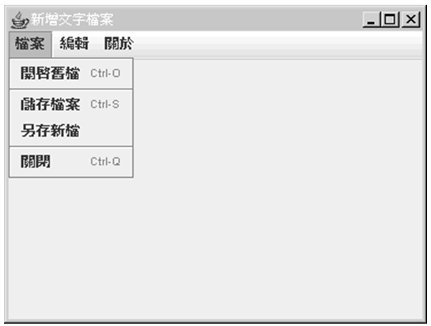

圖 19.6 範例 19.2 執行畫面

目前還沒有為每一個選單設置事件處理，所以您按下每一個選項時都不會有任何的反應。

### 19.2.3 版面管理

在 Container 中的元件的位置跟大小是由版面管理員（Layout manager）來決定，當 Container 需要決定它當中的元件的大小或位置時，就會呼叫版面管理員來為其執行。

- JTextArea 與 JScorllPane

文字編輯器的基本需求，就是有一個文字編輯區域，這個文字編輯區域可以使用 javax.swing.JTextArea 類別，然而 JTextArea 並不具備捲軸，文字內容多時沒有捲軸對於編輯或瀏覽都不方便，您可以在 JTextArea 上加上一個 javax.swing.JScrollPane，JScrollPane 會檢驗 JTextArea 的文字內容，在必要的時候顯示捲軸，或者是在操作捲軸時，也會對 JTextArea 進行相對應的位置顯示，以下是結合 JTextArea、JScrollPane 以建立文字編輯區域的程式碼片段：

    JTextArea textArea = new JTextArea();
    textArea.setFont(new Font("細明體", Font.PLAIN, 16));
    textArea.setLineWrap(true);
    JScrollPane panel = new JScrollPane(textArea,
              ScrollPaneConstants.VERTICAL_SCROLLBAR_AS_NEEDED,
              ScrollPaneConstants.HORIZONTAL_SCROLLBAR_NEVER);
          
您可以使用 JTextArea 的 setFont() 方法並指定 java.awt.Font 的實例，以設定文字顯示時的字型，以上面的程式碼為例，就是指定細明體、一般、16 點數的字型。setLineWrap() 方法設定為 true 時，表示在段落文字超出文字區域寬度時，會自動換行顯示。

JScrollPane 在建立時指定三個引數，一個是所將容納的 JTextArea 實例，另兩個是顯示垂直捲軸及水平捲軸的時機，在這邊垂直捲軸設定為 AS_NEEDED，表示在必要的時候會自動顯示捲軸，水平捲軸設定為 NEVER，表示永不顯示捲軸（因為已設定了自動換行，所以也就不需要水平捲軸了）。

JScrollPane 所採取的版面管理策略預設是 ScrollPaneLayout，預設的行為是將 JTextArea 填滿整個 JScrollPane，所以即使您沒有指定 JTextArea 的大小及位置，在待會的執行畫面中，您也將看到文字區域佔滿了視窗的中央。

- ContentPane

設置好 JScrollPane 之後，接下來要將它加入 JFrame 之中，在此之前您要了解到，Swing 視窗包括了幾個層次：RootPane、LayoutPane、ContentPane 和 MenuBar、GlassPane。由前而後每一個層次都包括管理了下一個層次，在最深層的是 RootPane，最上層的是 GlassPane。

對於初學 Swing 來說，最常接觸的是 ContentPane 與 MenuBar，它們位於同一個層次，在這個層次中如果具有 MenuBar，也就是若包括選單列的話，則 ContentPane 的大小為 LayoutPane 的大小減去選單列的大小，否則由 ContentPane 佔有全部的大小，基本上，視窗元件是加入至 ContentPane 中，在 JFrame 中要取得 ContentPane，可以使用繼承下來的 getContentPane() 方法，例如：

    Container contentPane = getContentPane();
    contentPane.add(panel, BorderLayout.CENTER);

如上所示的，在取得 ContentPane 之後，您可以使用 add() 方法將元件加入其中，ContentPane 預設上使用 BorderLayout，會將可容納元件的區域分作為東、西、南、北、中央五個區域，如下所示：
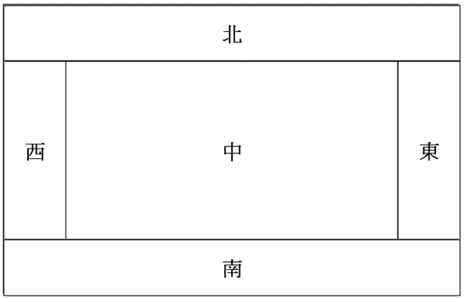

圖 19.7 BorderLayout 版面配置

在繪製元件位置時，BorderLayout 會先由北至南繪製，接著由西至東繪製，在不干擾到其它位置的情況儘可能填滿位置，所以在上面的程式碼片段中，由於只有一個 panel 物件被加入至 ContentPane，所以 panel 將佔滿中央位置。

- JLabel

接著製作狀態列，狀態列只是簡單的顯示「未修改」、「已修改」文字，以表示目前編輯中的檔案內容是否已經變數，顯示文字的工作可以由 javax.swing.JLabel，可以使用以下的程式碼片段來製作並加入至 ContentPane 中：

    // 狀態列
    JLabel stateBar = new JLabel("未修改");
    stateBar.setHorizontalAlignment(SwingConstants.LEFT); 
    stateBar.setBorder(
            BorderFactory.createEtchedBorder());
    contentPane.add(stateBar, BorderLayout.SOUTH);
    
在 JLabel 中的文字可以置左、置中或置右，這可以由 setHorizontalAlignment() 方法來決定，使用 SwingContants.LEFT 表示文字將靠左顯示。您可以使用 setBorder() 來設置 JLabel 的邊界外觀，在這邊使用 BorderFactory 建立一個有蝕刻外觀的邊界。最後，程式將 JLabel 的實例加入至 ContentPane，並設置在 BorderLayout 的南方。

範例 19.3 為加入了文字編輯區域、捲軸及狀態列後的程式碼，為了節省篇幅，僅列出部份的程式碼（主要是新增的程式碼部份）：

#### **範例 19.3　JNotePadUI.java**
```java
package onlyfun.caterpillar;

import java.awt.BorderLayout;
import java.awt.Container;
import java.awt.Font;
import java.awt.event.InputEvent;
import java.awt.event.KeyEvent;

import javax.swing.BorderFactory;
import javax.swing.JFrame;
import javax.swing.JLabel;
import javax.swing.JMenu;
import javax.swing.JMenuBar;
import javax.swing.JMenuItem;
import javax.swing.JScrollPane;
import javax.swing.JTextArea;
import javax.swing.KeyStroke;
import javax.swing.ScrollPaneConstants;
import javax.swing.SwingConstants;

public class JNotePadUI extends JFrame {
    public JNotePadUI() {
        super("新增文字檔案");
        setUpUIComponent();
        setUpEventListener();
        setVisible(true);
    }
    
    private void setUpUIComponent() {
        同範例19.2中setJMenuBar(menuBar)前的程式碼，故略...

        // 文字編輯區域
        JTextArea textArea = new JTextArea();
        textArea.setFont(new Font("細明體", Font.PLAIN, 16));
        textArea.setLineWrap(true);
        JScrollPane panel = new JScrollPane(textArea,
          ScrollPaneConstants.VERTICAL_SCROLLBAR_AS_NEEDED,
          ScrollPaneConstants.HORIZONTAL_SCROLLBAR_NEVER);
        
        Container contentPane = getContentPane();
        contentPane.add(panel, BorderLayout.CENTER);  
        
        // 狀態列
        JLabel stateBar = new JLabel("未修改");
        stateBar.setHorizontalAlignment(SwingConstants.LEFT); 
        stateBar.setBorder(
                BorderFactory.createEtchedBorder());
        contentPane.add(stateBar, BorderLayout.SOUTH);        
    }
    
    餘同範例19.2的程式碼，故略....
}
```

下圖為範例 19.3 撰寫、編譯、執行時，於當中編輯部份文字後所顯示的結果畫面：

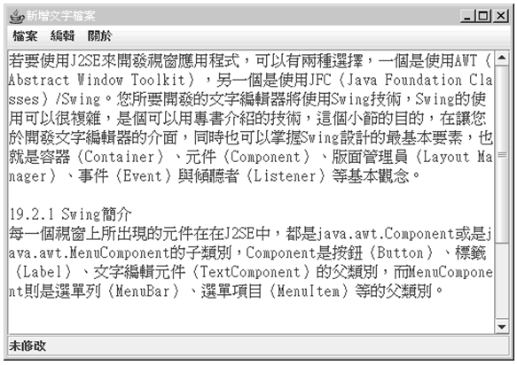

圖 19.8 範例 19.3 的執行畫面

到目前為止，您已經完成了介面設計的大部份需求，接下來要實際完成操作上的對應功能，這就涉及到視窗程式的另一個重要的觀念：事件處理（Event Handling）。這是下一個小節所即將要說明的重點。

## 19.3 事件處理

當使用者在圖形介面上進行一些操作時，例如移動滑鼠、選取選單項目等，將會引發相關事件（Event）的發生，在 Java 中事件以具體的物件來表示，使用者的相關動作會由JVM建立相對應的事件，用以描述事件來源、發生了什麼事、以及相關的訊息，您要藉由捕捉對應的事件，以進行對應的操作來完成應用程式的功能。

### 19.3.1 Java 事件模型

Java 對事件的處理採委託事件模型（Delegation event model），在這個模型之下，事件被送至對應的元件，而元件會將事件傳播至每一個事件傾聽者（Event listener），事件傾聽者中定義了與不同事件相對應的事件處理者（Event handler），只有向元件註冊的事件傾聽者才會收到事件，藉由這種模型，事件發生時是委託事件處理者進行處理，事件處理者與元件的設計可以分別獨立。

具體來說，事件傾聽者都實作了 java.util.EventListener 介面，不過這個介面只是個標示介面（Marker interface），當中並沒有規定必須實作的方法，對於 Java SE 視窗程式而言，相對應的事件傾聽者主要位於 java.awt.event 與 javax.swing.event 套件之下，它們都是 EventListener 的子介面。

### 19.3.2 文字編輯器的事件處理

以選單項目被按下時的事件處理來說，您要實作 java.awt.event.ActionListener 介面，例如：

    // 開啟舊檔選單項目的事件處理
    menuOpen.addActionListener(
            new ActionListener() {
                public void actionPerformed(ActionEvent e) {
                    openFile();
                }
            }
        );
        
這邊採取的是匿名類別的方式實作了 ActionListener 介面，這個介面定義了 actionPerformed() 方法，這個方法就是事件處理者，您要在當中實作選單項目被按下時所要進行的處理，當選單項目被按下時會發出 ActionEvent，這個事件會傳遞給曾向選單項目元件註冊的事件傾聽者，並呼叫對應的事件處理者，向選單項目元件註冊事件傾聽者的方式是使用 addActionListener() 方法。

以上示範的是 JMenuItem 的事件處理，至於 JTextArea 的事件方面，由於需求中主要是針對編輯文字時的事件作處理，編輯文字主要是鍵盤操作，因而會發生 KeyEvent 事件，您可以實作 java.awt.event.KeyListener 介面來設置相關的事件處理，這個介面中有三個方法（事件處理者）必須實作：

    package java.awt.event;
    public interface KeyListener {
         public void keyPressed(KeyEvent e)
         public void keyReleased(KeyEvent e)
         public void keyTyped(KeyEvent e)
    }
    
對您的文字編輯器而言，您所感興趣的主要是鍵盤被按下進行文字編輯時的事件處理，所以您可以僅實作 keyTyped() 方法，另兩個方法您可以在實作時保持空白即可，您也可以繼承 java.awt.event.KeyAdapter，KeyAdapter 類別實作 KeyListener 介面，而對三個方法實作時僅保持空白，藉由繼承 KeyAdapter，您可以僅重新定義 keyTyped() 方法，而不用對另兩個方法也進行實作，撰寫時較為方便且程式碼看來也會比較簡潔，您可以使用 JTextArea 的 addKeyListener() 方法加入事件傾聽者，例如：

    // 編輯區鍵盤事件
    textArea.addKeyListener(
        new KeyAdapter() {
            public void keyTyped(KeyEvent e) {
                processTextArea();
            }
        }
    );
    
文字編輯區也會有滑鼠事件，也就是使用滑鼠按右鍵顯示快顯功能表，以執行剪下、複製、貼上的動作來進行文字編輯，滑鼠事件傾聽者是實作 java.awt.event.MouseListener 介面，當中有五個方法必須實作，如果您覺得麻煩，則可以繼承 java.awt.event.MouseAdapter，它實作了 MouseListener 介面，但實作方法時保持空白，您也可以在繼承 MouseAdapter 後，對感興趣的事件處理者進行實作即可，例如：

    // 編輯區滑鼠事件
    textArea.addMouseListener(
        new MouseAdapter() {
            public void mouseReleased(MouseEvent e) {
                if(e.getButton() == MouseEvent.BUTTON3)
                    popUpMenu.show(editMenu, e.getX(), e.getY());
            }
        
            public void mouseClicked(MouseEvent e) {
                if(e.getButton() == MouseEvent.BUTTON1)
                    popUpMenu.setVisible(false);
            }
        }
    );

滑鼠處理者接受的是 MouseEvent，您可以使用 getButton() 方法取得一個常數，表示按下的是哪一個滑鼠鍵，MouseEvent.Button1 是指按下滑鼠左鍵，MouseEvent.Button3 則表示滑鼠右鍵，您使用 JTextArea的addMouseListener() 方法加入傾聽者，程式片段中的 popUpMenu 參考至 javax.swing.JPopupMenu 的實例，這個實例可用編輯選單直接取得，例如：

    JPopupMenu popUpMenu = editMenu.getPopupMenu();
    
還有一個事件是您要處理的，就是按下視窗右上角的 X 按鈕時，希望動作與按下選單中「關閉」具有相同的行為，所以您刪去原來程式中的這行：

    setDefaultCloseOperation(JFrame.EXIT_ON_CLOSE);
    
並且改為自行實作 java.awt.event.WindowListener，這個介面中有 7 個方法必須實作，如果覺得麻煩，您可以繼承 java.awt.event.WindowAdapter，它實作了 WindowListener，但在 7 個方法的實作本體上保持空白，您可以在繼承 WindowAdapter 類別之後，對感興趣的方法進行實作即可，例如：

    // 按下視窗關閉鈕事件處理
    addWindowListener(
        new WindowAdapter() {
            public void windowClosing(WindowEvent e) { 
                closeFile();
            }
        }
    );
    
您要向 JFrame 註冊 WindowListener，這可以使用 addWindowListener() 方法，windowClosing() 方法會在按下 X 按鈕後，視窗真正關閉前執行。

接下來將所有以上的說明實際套用至文字編輯器的實作中，先來看一下範例 19.4，為了節省篇幅，當中省略了一些前一個小節中已說明講解的，完整的程式碼可以查看光碟中的範例檔：

#### **範例 19.4　JNotePadUI.java**
```java
package onlyfun.caterpillar;

    略...

public class JNotePadUI extends JFrame {
    private JMenuItem menuOpen;
    private JMenuItem menuSave;
    private JMenuItem menuSaveAs;
    private JMenuItem menuClose;

    private JMenu editMenu;
    private JMenuItem menuCut;
    private JMenuItem menuCopy;
    private JMenuItem menuPaste;

    private JMenuItem menuAbout;
    
    private JTextArea textArea;
    
    private JPopupMenu popUpMenu;
    
    public JNotePadUI() {
        略....
    }
    
    private void setUpUIComponent() {
        略....
        
        popUpMenu = editMenu.getPopupMenu();
    }
    
    private void setUpEventListener() {
        // 按下視窗關閉鈕事件處理
        addWindowListener(
            new WindowAdapter() {
                public void windowClosing(WindowEvent e) { 
                    closeFile();
                }
            }
        );
        
        // 選單 - 開啟舊檔
        menuOpen.addActionListener(
            new ActionListener() {
                public void actionPerformed(ActionEvent e) {
                    openFile();
                }
            }
        );

        // 選單 - 儲存檔案
        menuSave.addActionListener(
            new ActionListener() {
                public void actionPerformed(ActionEvent e) {
                    saveFile();
                }
            }
        );

        // 選單 - 另存新檔
        menuSaveAs.addActionListener(
            new ActionListener() {
                public void actionPerformed(ActionEvent e) {
                    saveFileAs();
                }
            }
        );


        // 選單 - 關閉檔案
        menuClose.addActionListener(
            new ActionListener() {
                public void actionPerformed(ActionEvent e) {
                    closeFile();
                }
            }
        );

        // 選單 - 剪下
        menuCut.addActionListener(
            new ActionListener() {
                public void actionPerformed(ActionEvent e) {
                    cut();
                }
            }
        );

        // 選單 - 複製
        menuCopy.addActionListener(
            new ActionListener() {
                public void actionPerformed(ActionEvent e) {
                    copy();
                }
            }
        );

        // 選單 - 貼上
        menuPaste.addActionListener(
            new ActionListener() {
                public void actionPerformed(ActionEvent e) {
                    paste();
                }
            }
        );
        
        // 選單 - 關於
        menuAbout.addActionListener(
            new ActionListener() {
                public void actionPerformed(ActionEvent e) {
                    // 顯示對話方塊
                    JOptionPane.showOptionDialog(null, 
                        "程式名稱:\n    JNotePad \n" + 
                        "程式設計:\n    良葛格\n" + 
                        "簡介:\n    一個簡單的文字編輯器\n" + 
                        "    可作為驗收Java的實作對象\n" +
                        "    歡迎網友下載研究交流\n\n" +
                        "http://caterpillar.onlyfun.net/",
                        "關於JNotePad",
                        JOptionPane.DEFAULT_OPTION,
                        JOptionPane.INFORMATION_MESSAGE,
                        null, null, null);
                }
            }
        );      
        
        // 編輯區鍵盤事件
        textArea.addKeyListener(
            new KeyAdapter() {
                public void keyTyped(KeyEvent e) {
                    processTextArea();
                }
            }
        );

        // 編輯區滑鼠事件
        textArea.addMouseListener(
            new MouseAdapter() {
                public void mouseReleased(MouseEvent e) {
                    if(e.getButton() == MouseEvent.BUTTON3)
                        popUpMenu.show(editMenu, e.getX(), e.getY());
                }
                
                public void mouseClicked(MouseEvent e) {
                    if(e.getButton() == MouseEvent.BUTTON1)
                        popUpMenu.setVisible(false);
                }
            }
        );        
    }

    private void openFile() {}
    private void saveFile() {}    
    private void saveFileAs() {}    
    private void closeFile() {}
    private void cut() {}
    private void copy() {}    
    private void paste() {} 
    private void processTextArea() {}
    
    public static void main(String[] args) {
        new JNotePadUI();
    }
}
```

注意到一些視窗元件為了可以於 setUpEventListener() 方法中使用，已經將之宣告為類別成員的一部份（記得嗎？只有在必要時才擴大可視範圍！），目前事件發生後事件處理者呼叫的方法都是空的，在下一個小節中會完成這些方法中的邏輯，在 menuAbout 的事件處理上，主要是顯示一個對話方塊，直接來看看程式執行時按下「關於」選單項目時的執行畫面：

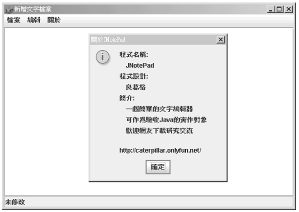

圖 19.9 範例 19.4 的執行畫面

有關事件處理的方面已經安排完畢，使用者圖形介面的部份到目前算是大部份完成，剩下的就是實際完成檔案編輯、儲存等的處理，這大部份是檔案輸入輸出方面的邏輯組合，將在下一個小節中進行說明。

## 19.4 文字編輯與儲存

在完成文字編輯器的大部份圖形介面之後，接下來要為文字編輯器的每一個事件，完成對應的事件處理，也就是完成先前的 openFile()、saveFile()、saveFileAs() 等方法的本體（Body）內容。

### 19.4.1 開啟檔案的流程處理

首先定義出當使用者選取選單上的「開啟舊檔」時，所需的處理流程：先檢查目前編輯中的文件是否已儲存，若是，則希望出現對話方塊供使用者選取所需的檔案、開啟它然後顯示在文字編輯區；若否，則出現對話方塊顯示"檔案已修改，是否儲存？"的訊息，若選擇「是」則儲存檔案，若選擇「否」則放棄目前檔案直接開啟舊檔。

上面的流程中，可以分出幾個子流程，例如檢查檔案是否儲存、開啟文件、儲存檔案，這幾個子流程可以先定義為方法，待會再來實作，因此可以先實作出以下的程式內容：

```java
private void openFile() {
    if(isCurrentFileSaved()) { // 文件是否為儲存狀態
        open(); // 開啟舊檔
    }
    else {
        // 顯示對話方塊
        int option = JOptionPane.showConfirmDialog(
                null, "檔案已修改，是否儲存？",
                "儲存檔案？", JOptionPane.YES_NO_OPTION, 
                JOptionPane.WARNING_MESSAGE, null);
        switch(option) { 
            // 確認檔案儲存
            case JOptionPane.YES_OPTION:
                saveFile(); // 儲存檔案
                 break;
           // 放棄檔案儲存
            case JOptionPane.NO_OPTION:
                open();
                break;
        }
    }
}

private void open() { }

private boolean isCurrentFileSaved() {
        return false;
}
```

JOptionPane.showConfirmDialog() 可以出現一個訊息對話方塊，設定 JOptionPane.YES_NO_OPTION 會出現「是」、「否」的按鈕，而設定 JOptionPane.WARNING_MESSAGE 會出現一個警告圖示，在確認是否之後，會得到一個 int 常數，與 JOptionPane.YES_OPTION 或 JOptionPane.YES_OPTION 比對，即可得知使用者按下了哪一個按鈕。


圖 19.10 顯示是否的對話方塊

在判斷檔案是否儲存的方法上，主要是根據狀態列來進行判斷，實作出內容如下：

```java
private boolean isCurrentFileSaved() {
    if(stateBar.getText().equals("未修改")) {
        return false;
    }
    else {
        return true;
    }
}
```

至於開啟檔案時則是使用 javax.swing.JFileChooser 來顯示檔案選取的對話方塊，這部份的流程說明，在以下的程式碼片段中直接以註解來表示：

```java
private void open() {
    // fileChooser 是 JFileChooser 的實例
    // 顯示檔案選取的對話方塊
    int option = fileChooser.showDialog(null, null);
        
    // 使用者按下確認鍵
    if(option == JFileChooser.APPROVE_OPTION) {
        try {
            // 開啟選取的檔案
            BufferedReader buf = 
                new BufferedReader(
                   new FileReader(
                     fileChooser.getSelectedFile()));

            // 設定文件標題
            setTitle(fileChooser.getSelectedFile().toString());
            // 清除前一次文件
            textArea.setText("");
            // 設定狀態列
            stateBar.setText("未修改");
            // 取得系統相依的換行字元
            String lineSeparator = System.getProperty("line.separator");
            // 讀取檔案並附加至文字編輯區
            String text;
            while((text = buf.readLine()) != null) {
                textArea.append(text);
                textArea.append(lineSeparator);
            }

            buf.close();
        }   
        catch(IOException e) {
            JOptionPane.showMessageDialog(null, e.toString(),
                "開啟檔案失敗", JOptionPane.ERROR_MESSAGE);
        }
    }        
}
```

下圖是執行時的檔案對話方塊畫面：

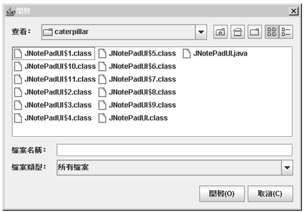

圖 19.11 顯示選取檔案的對話方塊

### 19.4.2 儲存檔案的流程處理

在選單上有「儲存檔案」及「另存新檔」兩個選項，但事實上另存新檔只是多了個顯示檔案選擇對話方塊的動作，在設定好檔案之後，所使用的仍是儲存檔案的流程。

先從「另存新檔」開始，在執行另存新檔時，顯示檔案選擇對話方塊，讓使用者輸入檔案名稱，在確認後將文字編輯區的內容儲存至指定的檔案中。而在按下「儲存檔案」時，如果標題列上有指定檔案的路徑，則直接依該路徑儲存檔案，否則執行另存新檔的流程。

程式實作的片段如下所示：

```java
private void saveFile() {
    // 從標題列取得檔案名稱
    File file = new File(getTitle());

    // 若指定的檔案不存在
    if(!file.exists()) {
        // 執行另存新檔
        saveFileAs();
    }
    else {
        try {
            // 開啟指定的檔案
            BufferedWriter buf = 
                new BufferedWriter(
                        new FileWriter(file));
            // 將文字編輯區的文字寫入檔案
            buf.write(textArea.getText());
            buf.close();
            // 設定狀態列為未修改
            stateBar.setText("未修改");
        }
        catch(IOException e) {
            JOptionPane.showMessageDialog(null, e.toString(),
              "寫入檔案失敗", JOptionPane.ERROR_MESSAGE);
        }
    }
}

private void saveFileAs() {
    // 顯示檔案對話方塊
    int option = fileChooser.showDialog(null, null);

    // 如果確認選取檔案
    if(option == JFileChooser.APPROVE_OPTION) {
        // 取得選擇的檔案
        File file = fileChooser.getSelectedFile();
        
        // 在標題列上設定檔案名稱
        setTitle(file.toString());
            
        try {
            // 建立檔案
            file.createNewFile();
            // 進行檔案儲存
                saveFile();
        }
        catch(IOException e) {
        JOptionPane.showMessageDialog(null, e.toString(),
               "無法建立新檔", JOptionPane.ERROR_MESSAGE);
        }
    }   
}
```

### 19.4.3 關閉檔案的流程處理

關閉檔案之前，主要必須檢查文字編輯區的內容變動是否已儲存，如果沒有儲存的話，則出現對話方塊提示使用者確認是否儲存，若確認儲存則進行儲存檔案或另存新檔的動作，否則直接關閉檔案。程式的實作如下所示：

```java
private void closeFile() {
    // 是否已儲存文件
    if(isCurrentFileSaved()) {
        // 釋放視窗資源，而後關閉程式
        dispose();
    }
    else {
        int option = JOptionPane.showConfirmDialog(
                null, "檔案已修改，是否儲存？",
                "儲存檔案？", JOptionPane.YES_NO_OPTION, 
                JOptionPane.WARNING_MESSAGE, null);

        switch(option) {
            case JOptionPane.YES_OPTION:
                saveFile();
                break;
            case JOptionPane.NO_OPTION:
               dispose();
        }
    }
}
```

### 19.4.4 文字區的編輯、剪下、複製、貼上

在文字編輯區進行剪下、複製、貼上的動作，可以直接呼叫 JTextArea 的 cut()、copy() 與 paste() 方法，另外還特別處理了快顯功能表以及狀態列的問題，這部份的程式很簡單，直接以程式碼片段來表示：

```java
private void cut() {
    textArea.cut();
    stateBar.setText("已修改");
    popUpMenu.setVisible(false);
}

private void copy() {
    textArea.copy();
    popUpMenu.setVisible(false);    
}

private void paste() {
    textArea.paste();
    stateBar.setText("已修改");
    popUpMenu.setVisible(false);
}

private void processTextArea() {
        stateBar.setText("已修改");
}
```

到這邊為止，您的文字編輯器大致上都已經完成，下圖先列出一個執行時的參考畫面：

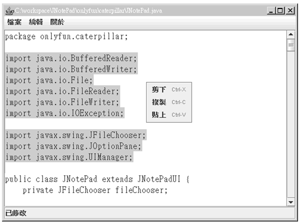

圖 19.12 完成的程式參考畫面

由於先前已經顯示出相關的程式碼片段，這邊就不再貼出完整的範例檔，您可以直接在光碟中找到完整的程式碼（JNotePad.java），另一方面，這個程式還可以加上更多的功能，在光碟中也有實作出有工具列、有圖示、具列印功能的文字編輯器，有興趣的話可以自行參考。

## 19.5 Executable Jar 的製作

撰寫 Java 程式到這邊，相信您一定會有所疑問的是，編出來的 .class 檔案越來越多，難道要將這一堆 .class 檔案直接給想要執行程式的人嗎？在 Windows 下的話，有沒有辦法按一下檔案，就可以執行程式呢？

當然，實際上要交付程式時，並不是給一堆 .class 檔案，而是會將編譯好的 .class 檔包裝為一個J ava Archive File，也就是副檔名為 .jar 的檔案，在 JDK 的 bin 目錄下，附帶有一個 jar 工具程式，您可以直接執行 jar 程式，看看它的提示訊息：

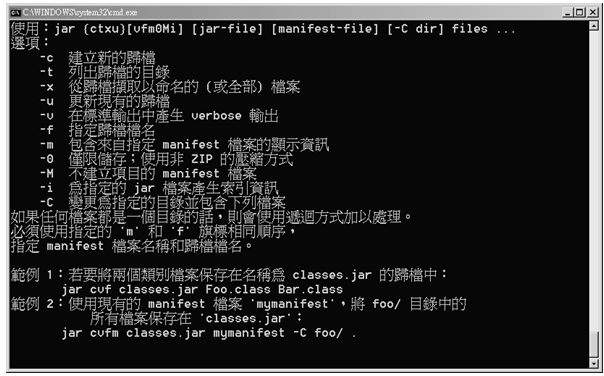

圖 19.13 執行 jar 工具程式

直接執行 jar 工具程式，提示訊息中已清楚的說明如何使用 jar 程式，在這邊使用前面完成的文字編輯器為例，來示範如何將程式包裝為 .jar 的檔案，首先請建立一個 jar 目錄，並在其下建立 bin 與 classes 目錄，將您完成的文字編輯器程式放入 classes 中（包括套件的資料夾結構），待會將會產生的 .jar 則將放入 bin 中。

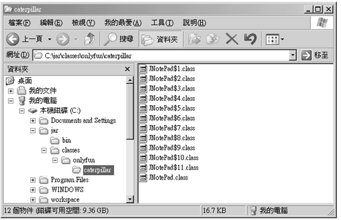

圖 19.14 準備製作 jar 檔案

接著開啟文字模式，切換工作目錄至 jar 目錄下，然後鍵入以下的指令，表示將建立一個 JNotePad.jar 放到 bin 目錄中，來源是 classes 中的檔案，被放入的檔案將以 / 作為 .jar 檔案中的根目錄：


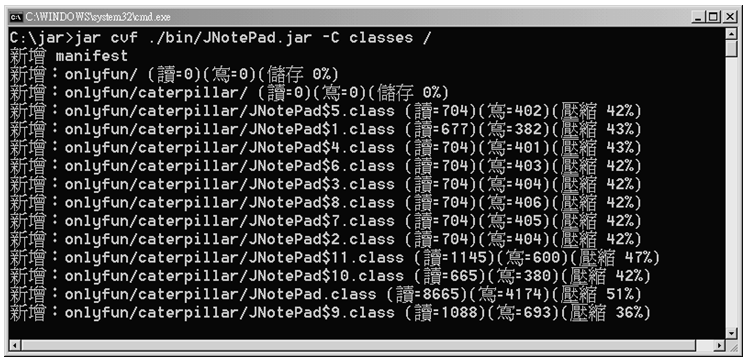

圖 19.15 製作 jar 檔案

接著您的 bin 目錄中就會產生一個 JNotePad.jar，要如何使用這個 .jar 檔案呢？.jar 檔案中包括 .class，基本上可以將 .jar 看作是一個特別的目錄，所以要使用 .jar 檔案中的 .class 檔案時，基本上也是指定 Classpath，例如：

    java -cp ./bin/JNotePad.jar onlyfun.caterpillar.JNotePad

接著您的文字編輯器就會啟動了，現在您不用將一堆 .class 檔案交付出去，只要交付這個 JNotePad.jar 就可以了。

然而，真的要指定 Classpath 這麼麻煩嗎？其實還有更方便的做法，製作一 個Executable Jar 檔案，指定讀取 .jar 檔案時要執行的 Main-Class 就可以了，這需要準備一個 manifest.txt，當中寫下：


圖 19.16 準備 manifest 檔案

注意寫完 Main-Class 之後，要按下 Enter 鍵新增一行，在 Windows 下這個動作是必要的，否則會發生無法讀取 Main-Class 屬性的錯誤。假設 manifest.txt 放在 jar 目錄下，接著如下執行指令：

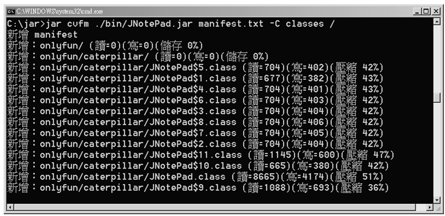

圖 19.17 指定 manifest 檔案並製作 jar 檔案

在 .jar 檔案製作出來後，您可以在執行 java 時指定 -jar 引數，以及您的 .jar 檔案，java 程式會自動尋找 Main-Clas s並執行，例如下達以下的指令：

    java -jar bin/JNotePad.jar

接著您的文字編輯器就會啟動了，如果您的作業系統是 Windows，由於安裝完 JRE 之後，會將 .jar 預設由 javaw 程式開啟，所以您可以直接在 JNotePad.jar 檔案上，使用滑鼠左鍵按兩下直接開啟程式來執行。

## 19.6 接下來的主題

現在許多應用程式，都必須以龐大的資料作為基礎，而這些龐大的資料常儲存在資料庫系統之中，Java 對於資料庫存取所提出的解決方案是 JDBC，資料庫存取是一個很大的主題，可以使用專書進行講解，不過在下一個章節中，則將介紹一些 JDBC 的基本存取，讓您對於資料庫存取有個基本認識。
